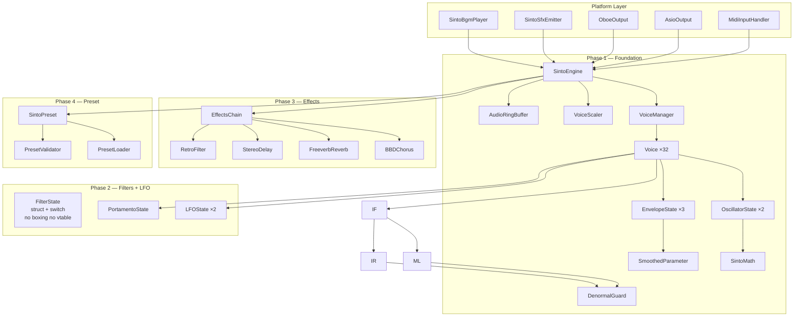

# Sinto — Class and Method Design v1.2

**Date:** 2026-05-25  
**Version:** 1.2 (Gemini: static buffer purge + IFilter→FilterState + SintoMicroEngine)  
**Status:** Confirmed — GO  
**Based on:** synthesizer_spec_v1.1.md  
**Supersedes:** class_and_method_design_v1.1.md  
**Language:** C# 12 / .NET 8

---

## Table of Contents

1. [Namespace Structure](#1-namespace-structure)
2. [Dependency Graph — All Phases](#2-dependency-graph--all-phases)
3. [Enumerations](#3-enumerations)
4. [Sinto.Core.Audio](#4-sintocoreaudio)
5. [Sinto.Core.Synth](#5-sintocoresynth)
6. [Sinto.Core.Filter](#6-sintocorefilter)
7. [Sinto.Core.Effects](#7-sintocoreeffects)
8. [Sinto.Core.Preset](#8-sintocorepreset)
9. [Sinto.Unity](#9-sintounity)
10. [Sinto.Standalone](#10-sintostandalone)
11. [Cross-Class Edge Case Matrix](#11-cross-class-edge-case-matrix)
12. [Design Decisions and Rationale](#12-design-decisions-and-rationale)

---

## 1. Namespace Structure

```
Sinto.Core
├── Audio                        Phase 1
│   ├── AudioRingBuffer<T>
│   ├── ControlEvent
│   ├── ControlEventKind
│   └── DenormalGuard
├── Synth                        Phase 1
│   ├── SintoMath
│   ├── SmoothedParameter        ← snap-on-NoteOn
│   ├── InterpMode
│   ├── WaveType
│   ├── VoiceState
│   ├── FilterMode
│   ├── RetroMode
│   ├── Note
│   ├── OscillatorParams
│   ├── EnvelopeParams
│   ├── LFOParams                Phase 2
│   ├── PortamentoState          Phase 2
│   ├── EnvelopeState
│   ├── OscillatorState
│   ├── LFOState                 Phase 2
│   ├── Voice
│   ├── VoiceConfig
│   ├── VoiceScaler
│   ├── VoiceManager
│   └── SintoEngine
├── Filter                       Phase 2
│   └── FilterState              ← IFilter abolished — struct + switch(FilterMode)
├── Effects                      Phase 3
│   ├── IEffect
│   ├── MonoCompatibleEffect
│   ├── BBDChorus
│   ├── FreeverbReverb
│   ├── StereoDelay
│   ├── RetroFilter
│   └── EffectsChain
└── Preset                       Phase 4
    ├── SintoPreset
    ├── OscillatorPreset
    ├── FilterPreset
    ├── EnvelopePreset
    ├── LFOPreset
    ├── EffectsPreset
    ├── PresetValidator
    └── PresetLoader

Sinto.Unity                      Phase 1 / 4
├── SintoBgmPlayer
├── SintoSfxEmitter      ← uses SintoMicroEngine (NOT SintoEngine)
└── SintoMicroEngine     ← lightweight SFX-only engine

Sinto.Standalone                 Phase 2 / 4
├── OboeOutput
├── AsioOutput
├── MidiInputHandler
└── StandaloneApp
```

---

## 2. Dependency Graph — All Phases



---

## 3. Enumerations

### 3.1 `ControlEventKind`

```csharp
namespace Sinto.Core.Audio;

public enum ControlEventKind : byte
{
    NoteOn        = 0,
    NoteOff       = 1,
    Pause         = 2,
    Resume        = 3,
    SetVoiceLimit = 4,
    SwapPreset    = 5,  // Interlocked.Exchange — NOT 50 parameter events
    SetBPM        = 6,  // FloatParam = BPM (for LFO / Delay tempo sync)
    // LoadPreset intentionally ABSENT
}
```

### 3.2 `WaveType`

```csharp
namespace Sinto.Core.Synth;

public enum WaveType : byte
{
    Sine     = 0,
    Saw      = 1,
    Triangle = 2,
    Square   = 3,  // Pulse width controlled by OscillatorParams.PulseWidth
    Noise    = 4,
}
```

### 3.3 `InterpMode`

```csharp
namespace Sinto.Core.Synth;

public enum InterpMode : byte
{
    Linear          = 0,  // Standard — clean sound
    NearestNeighbor = 1,  // N64 mode — inharmonic aliasing is the aesthetic
}
```

### 3.4 `VoiceState`

```csharp
namespace Sinto.Core.Synth;

public enum VoiceState : byte
{
    Free         = 0,
    Attack       = 1,
    Decay        = 2,
    Sustain      = 3,
    Release      = 4,
    QuickRelease = 5,  // Voice Stealing fade — 5ms
}
```

### 3.5 `FilterMode`

```csharp
namespace Sinto.Core.Synth;

public enum FilterMode : byte
{
    Roland = 0,  // IR3109 — warm, smooth (pads, strings)
    Moog   = 1,  // Moog Ladder — punchy, aggressive (bass, SFX)
}
```

### 3.6 `RetroMode`

```csharp
namespace Sinto.Core.Synth;

public enum RetroMode : byte
{
    Clean = 0,  // 44100Hz / 32-bit float — no degradation
    N64   = 1,  // 22050Hz / 16-bit — Nearest-Neighbor aliasing
    PS1   = 2,  // 11025Hz / 8-bit  — ADPCM BRR waveshaper
}
```

### 3.7 `LFOWave`

```csharp
namespace Sinto.Core.Synth;

public enum LFOWave : byte
{
    Sine     = 0,
    Triangle = 1,
    Square   = 2,
    SH       = 3,  // Sample and Hold — random staircase (retro computer sounds)
}
```

### 3.8 `LFODestination` (Flags)

```csharp
namespace Sinto.Core.Synth;

[Flags]
public enum LFODestination : byte
{
    None        = 0,
    OSC1Pitch   = 1 << 0,  // Vibrato on OSC 1
    OSC2Pitch   = 1 << 1,  // Vibrato on OSC 2
    OSC1PWM     = 1 << 2,  // Pulse width modulation OSC 1
    OSC2PWM     = 1 << 3,  // Pulse width modulation OSC 2
    FilterCutoff = 1 << 4, // Wah / filter sweep
    Amp         = 1 << 5,  // Tremolo
}
```

---

## 4. Sinto.Core.Audio

### 4.1 `ControlEvent`

```csharp
namespace Sinto.Core.Audio;

[StructLayout(LayoutKind.Sequential)]
public readonly struct ControlEvent : IEquatable<ControlEvent>
{
    public readonly ControlEventKind Kind;
    // OffsetFrames: sample position within current audio buffer.
    // Without this, all events fire at buffer[0] → max 46ms jitter.
    public readonly ushort OffsetFrames; // [0, bufferLength - 1]
    public readonly int    IntParam;     // MidiNote / VoiceLimit
    public readonly float  FloatParam;  // Velocity [0,1] / BPM value
    public readonly int    TrackId;     // [0, 7]
    public readonly int    Priority;    // Voice stealing [0, 255]

    public ControlEvent(
        ControlEventKind kind,
        ushort offsetFrames = 0,
        int    intParam     = 0,
        float  floatParam   = 0f,
        int    trackId      = 0,
        int    priority     = 0);

    public bool Equals(ControlEvent other);
    public override bool Equals(object? obj);
    public override int  GetHashCode();
    public static bool operator ==(ControlEvent a, ControlEvent b);
    public static bool operator !=(ControlEvent a, ControlEvent b);
}
```

**Edge Cases**

| Field | Min | Max | Invalid behavior |
|---|---|---|---|
| OffsetFrames | 0 | ushort.Max | Clamped in sub-buffer loop |
| IntParam (NoteOn) | 0 | 127 | Clamped in VoiceManager |
| FloatParam (Velocity) | 0.0f | 1.0f | Clamped in Voice.NoteOn |
| FloatParam (BPM) | 20.0f | 300.0f | Clamped in SintoEngine |
| TrackId | 0 | 7 | Clamped to [0,7] |
| Priority | 0 | 255 | Higher = harder to steal |

---

### 4.2 `AudioRingBuffer<T>`

```csharp
namespace Sinto.Core.Audio;

// SPSC lock-free ring buffer.
// LayoutKind.Explicit FORBIDDEN on generic class → TypeLoadException.
// Use Sequential + manual long padding (7 × 8 = 56 bytes between _head and _tail).
// Capacity MUST be power of 2 — bitmask (n & mask) requires this.
[StructLayout(LayoutKind.Sequential)]
public sealed class AudioRingBuffer<T> where T : struct
{
    // Cache line 0: read-only after ctor
    private readonly T[]  _buffer;
    private readonly int  _mask;

    // Padding → push _head to next cache line
    private long _p1, _p2, _p3, _p4, _p5, _p6, _p7;

    // Cache line 1: audio thread writes
    private int _head;

    // Padding → push _tail to next cache line
    private long _p8, _p9, _p10, _p11, _p12, _p13, _p14;

    // Cache line 2: main thread writes
    private int _tail;

    /// <param name="capacityPow2">Must be positive power of 2.</param>
    /// <exception cref="ArgumentException">Not a power of 2.</exception>
    public AudioRingBuffer(int capacityPow2 = 1024);

    public int  Count   { get; }  // Approximate
    public bool IsEmpty { get; }
    public bool IsFull  { get; }

    /// <summary>Main thread only. No lock. No allocation.</summary>
    public bool TryEnqueue(in T item);

    /// <summary>Audio thread only. No lock. No allocation.</summary>
    public bool TryDequeue(out T item);
}
```

**Decision Table: Constructor Guard**

| Input | Power of 2? | Result |
|---|---|---|
| 1, 2, 4, 512, 1024, 2048 | YES | OK |
| 0, -1 | NO (not positive) | ArgumentException |
| 3, 1000, 1023, 1025 | NO | ArgumentException |
| int.MaxValue | NO | ArgumentException |

**Decision Table: TryEnqueue / TryDequeue**

| State | TryEnqueue | TryDequeue |
|---|---|---|
| Empty | true, _tail++ | false, item=default |
| Partial | true, _tail++ | true, _head++ |
| Full | false (drop) | true, _head++ |

---

### 4.3 `DenormalGuard`

```csharp
namespace Sinto.Core.Audio;

// NO static state — Unity FMOD runs multiple OnAudioFilterRead threads simultaneously.
// Static _sign field → data race → filter divergence.
// Solution: derive sign from sampleIndex parity (per-voice counter, already tracked).
public static class DenormalGuard
{
    private const float Magnitude = 1e-15f;

    /// <summary>
    /// Inject alternating DC offset to prevent IIR subnormal trap.
    /// Sign = sampleIndex parity → zero additional state, thread-safe.
    /// </summary>
    [MethodImpl(MethodImplOptions.AggressiveInlining)]
    public static float Protect(float x, long sampleIndex)
        => x + ((sampleIndex & 1L) == 0L ? Magnitude : -Magnitude);

    /// <summary>Returns true if x is subnormal. For tests only.</summary>
    [MethodImpl(MethodImplOptions.AggressiveInlining)]
    public static bool IsDenormal(float x);
}
```

**Decision Table**

| sampleIndex parity | Sign | Result |
|---|---|---|
| Even | + | x + 1e-15f |
| Odd | − | x − 1e-15f |

**Edge Cases**

| Input x | sampleIndex | Expected |
|---|---|---|
| 0.0f | 0 | 1e-15f |
| 0.0f | 1 | -1e-15f |
| 1e-40f (subnormal) | 0 | ≈ 1e-15f (not subnormal) |
| float.NaN | any | NaN (propagated — caller must not pass NaN) |

---

## 5. Sinto.Core.Synth

### 5.1 `SintoMath`

```csharp
namespace Sinto.Core.Synth;

// Math.Sin and Math.Pow are FORBIDDEN in hot paths.
// Implementation (LUT vs polynomial) decided by Android benchmark — Task 1.3.
public static class SintoMath
{
    public const int LutSize = 4096; // 16KB — profile cache miss on device

    /// <summary>Fast sine. Input: [0, 2π). Output: [-1, 1].</summary>
    [MethodImpl(MethodImplOptions.AggressiveInlining)]
    public static float SinFast(double phase);

    /// <summary>Fast tanh. Input: [-3, +3]. Used in filter saturation.</summary>
    [MethodImpl(MethodImplOptions.AggressiveInlining)]
    public static float TanhFast(float x);

    /// <summary>
    /// Fast pitch ratio: 2^(semitones/12).
    /// LUT indexed by semitone offset [-24, +24].
    /// </summary>
    [MethodImpl(MethodImplOptions.AggressiveInlining)]
    public static float PitchRatioFast(float semitones);

    /// <summary>Initialize LUT tables. Call once at startup. No-op in polynomial mode.</summary>
    public static void Initialize();

    public static bool IsLutMode { get; }
}
```

---

### 5.2 `SmoothedParameter`

```csharp
namespace Sinto.Core.Synth;

// One-pole lowpass smoothing for all real-time parameters.
// Prevents zipper noise when MIDI CC / LFO changes parameter at control rate.
// CRITICAL: SnapToTarget() MUST be called on NoteOn.
//   Without snap, stolen voice carries previous parameter state → "pyun" artifact.
public struct SmoothedParameter
{
    private float _current;
    private float _target;
    private float _coeff;  // 1 - exp(-2π × cutoffHz / sampleRate) ≈ 0.003 at 20Hz

    /// <param name="initialValue">Starting value — also set as current on construction.</param>
    /// <param name="smoothingHz">Cutoff frequency. Default 20Hz ≈ 8ms.</param>
    public SmoothedParameter(float initialValue, float smoothingHz = 20f, int sampleRate = 44100);

    public float Current { get; }
    public float Target  { get; }

    /// <summary>
    /// Set new target. Smoothing will interpolate current → target over ~8ms.
    /// Call from: MIDI CC handler, LFO tick, envelope modulation.
    /// </summary>
    public void SetTarget(float target);

    /// <summary>
    /// Advance by one sample. Returns current smoothed value.
    /// Called in audio hot path — must be allocation-free.
    /// </summary>
    [MethodImpl(MethodImplOptions.AggressiveInlining)]
    public float Tick();

    /// <summary>
    /// Instantly set current = target. Bypass interpolation.
    /// MUST be called on NoteOn (new voice or stolen voice).
    /// Prevents transient artifact from previous voice's parameter state.
    /// </summary>
    [MethodImpl(MethodImplOptions.AggressiveInlining)]
    public void SnapToTarget();

    /// <summary>Initialize smoothing coefficient for given sample rate.</summary>
    public void SetSampleRate(int sampleRate, float smoothingHz = 20f);
}
```

**Decision Table: SmoothedParameter usage**

| Event | Method to call | Reason |
|---|---|---|
| NoteOn (new voice) | `SnapToTarget()` then `SetTarget()` | No transient artifact |
| NoteOn (stolen voice) | `SnapToTarget()` then `SetTarget()` | Discard previous voice state |
| MIDI CC change | `SetTarget(newValue)` | Smooth 8ms interpolation |
| LFO modulation | `SetTarget(baseValue + lfoAmount)` per sample | Continuous smooth |
| SwapPreset | `SnapToTarget()` on all params | Clean instant transition |
| During playback | `Tick()` every sample | Advance interpolation |

**Edge Cases**

| Scenario | Expected behavior |
|---|---|
| SnapToTarget before any SetTarget | current = initialValue |
| SetTarget(same value) | No change, Tick() returns stable value |
| SetTarget outside [0,1] range | Caller must clamp before calling |
| sampleRate = 0 | ArgumentException in constructor |

---

### 5.3 `Note`

```csharp
namespace Sinto.Core.Synth;

[StructLayout(LayoutKind.Sequential)]
public readonly struct Note : IEquatable<Note>
{
    public readonly int   MidiNote;  // [0, 127] — clamped in ctor
    public readonly float Velocity;  // [0.0, 1.0] — clamped in ctor
    public readonly int   TrackId;   // [0, 7]
    public readonly int   Priority;  // [0, 255]

    public Note(int midiNote, float velocity, int trackId, int priority);

    // f = 440 × 2^((midiNote - 69) / 12)
    // Computed via SintoMath.PitchRatioFast — no Math.Pow
    public float FrequencyHz { get; }

    public bool Equals(Note other);
    public override bool Equals(object? obj);
    public override int  GetHashCode();
}
```

---

### 5.4 `OscillatorParams`

```csharp
namespace Sinto.Core.Synth;

[StructLayout(LayoutKind.Sequential)]
public readonly struct OscillatorParams
{
    public readonly WaveType   Wave;
    public readonly InterpMode Interp;
    public readonly float      DetuneCents;  // [-100, +100] — OSC 2 only
    public readonly float      PulseWidth;   // [0.01, 0.99] — Square only
    public readonly float      Level;        // [0.0, 1.0]

    public OscillatorParams(
        WaveType   wave,
        InterpMode interp      = InterpMode.Linear,
        float      detuneCents = 0f,
        float      pulseWidth  = 0.5f,
        float      level       = 1.0f);
}
```

---

### 5.5 `EnvelopeParams`

```csharp
namespace Sinto.Core.Synth;

[StructLayout(LayoutKind.Sequential)]
public readonly struct EnvelopeParams
{
    public readonly float Attack;   // [0.001, 10.0] sec
    public readonly float Decay;    // [0.001, 10.0] sec
    public readonly float Sustain;  // [0.0, 1.0]
    public readonly float Release;  // [0.001, 20.0] sec

    public EnvelopeParams(
        float attack  = 0.01f,
        float decay   = 0.1f,
        float sustain = 0.8f,
        float release = 0.2f);

    // Minimum 0.001 prevents division-by-zero in rate computation
    public static readonly EnvelopeParams Default;
    public static readonly EnvelopeParams Percussive;  // Fast attack/decay, sustain=0
    public static readonly EnvelopeParams Pad;         // Slow attack, long release
}
```

---

### 5.6 `LFOParams` (Phase 2)

```csharp
namespace Sinto.Core.Synth;

[StructLayout(LayoutKind.Sequential)]
public readonly struct LFOParams
{
    public readonly LFOWave        Wave;
    public readonly float          Rate;         // [0.01, 20.0] Hz (free) or grid value
    public readonly float          Depth;        // [0.0, 1.0]
    public readonly bool           TempoSync;    // Lock to BPM grid
    public readonly float          SyncNoteValue; // e.g. 0.25 = 1/4 note
    public readonly LFODestination Destinations; // Flags bitmask

    public LFOParams(
        LFOWave        wave,
        float          rate         = 1.0f,
        float          depth        = 0.5f,
        bool           tempoSync    = false,
        float          syncNote     = 0.25f,
        LFODestination destinations = LFODestination.FilterCutoff);
}
```

---

### 5.7 `EnvelopeState`

```csharp
namespace Sinto.Core.Synth;

public struct EnvelopeState
{
    private float      _level;
    private VoiceState _phase;
    private float      _attackRate;
    private float      _decayRate;
    private float      _releaseRate;
    private float      _sustainLevel;
    private float      _quickReleaseRate;  // 1.0 / (0.005 × sampleRate)

    public float      Level { get; }
    public VoiceState Phase { get; }
    public bool       IsDone { get; }  // true when Release reaches 0

    /// <summary>Initialize and start Attack. Call on NoteOn.</summary>
    public void NoteOn(in EnvelopeParams p, int sampleRate);

    /// <summary>Transition to Release. Call on NoteOff.</summary>
    public void NoteOff();

    /// <summary>Begin 5ms QuickRelease. Call on Voice Steal.</summary>
    public void StartQuickRelease(int sampleRate);

    /// <summary>
    /// Advance one sample. Returns current level.
    /// 44,100 × voiceCount calls/sec — must be allocation-free.
    /// </summary>
    [MethodImpl(MethodImplOptions.AggressiveInlining)]
    public float Tick();
}
```

**Decision Table: EnvelopeState transitions**

| Phase | Condition | Level change | Next phase |
|---|---|---|---|
| Attack | _level < 1.0f | += _attackRate | — |
| Attack | _level >= 1.0f | = 1.0f | Decay |
| Decay | _level > sustain | -= _decayRate | — |
| Decay | _level <= sustain | = sustain | Sustain |
| Sustain | always | = sustain (hold) | — |
| Release | _level > 0.0f | -= _releaseRate | — |
| Release | _level <= 0.0f | = 0.0f | Free (IsDone) |
| QuickRelease | _level > 0.0f | -= _quickReleaseRate | — |
| QuickRelease | _level <= 0.0f | = 0.0f | Free (IsDone) |

---

### 5.8 `OscillatorState`

```csharp
namespace Sinto.Core.Synth;

public struct OscillatorState
{
    private double _phase;       // [0, 2π)
    private double _phaseInc;    // 2π × frequency / sampleRate
    private uint   _noiseSeed;   // LCG PRNG state
    private long   _sampleCount; // For DenormalGuard parity

    public void SetFrequency(float frequencyHz, int sampleRate);

    /// <summary>
    /// Generate next sample [-1, 1].
    /// InterpMode.NearestNeighbor = N64 aliasing (no interpolation).
    /// </summary>
    [MethodImpl(MethodImplOptions.AggressiveInlining)]
    public float Tick(in OscillatorParams p);

    private float TickSine(InterpMode mode);
    private float TickSaw();
    private float TickTriangle();
    private float TickSquare(float pulseWidth);
    private float TickNoise();
}
```

**Decision Table: Waveforms**

| Wave | InterpMode | Algorithm | Character |
|---|---|---|---|
| Sine | Linear | SintoMath.SinFast | Clean, pure |
| Sine | NearestNeighbor | Truncated LUT index | N64 metallic |
| Saw | Either | (phase/π) - 1.0 | Bright, rich |
| Triangle | Either | 2×abs(saw) - 1.0 | Soft, hollow |
| Square | Either | sign with PW gate | Hollow, nasal |
| Noise | Either | LCG: seed×1664525+1013904223 | White noise |

**Edge Cases**

| Scenario | Expected |
|---|---|
| frequencyHz ≤ 0 | Clamped to 1.0f |
| frequencyHz > 22050 | Valid (aliasing = aesthetic) |
| PulseWidth = 0.0f | Clamped to 0.01f |
| PulseWidth = 1.0f | Clamped to 0.99f |
| _sampleCount overflow | ~292 billion years at 44100Hz |

---

### 5.9 `LFOState` (Phase 2)

```csharp
namespace Sinto.Core.Synth;

public struct LFOState
{
    private double _phase;
    private double _phaseInc;
    private float  _shValue;     // Current S&H held value
    private float  _shPrevPhase; // For S&H trigger detection
    private float  _currentBpm;  // Received via SetBPM event

    public void Initialize(in LFOParams p, int sampleRate, float bpm = 120f);

    /// <summary>Update BPM. Recalculate _phaseInc if TempoSync is on.</summary>
    public void SetBPM(float bpm, in LFOParams p, int sampleRate);

    /// <summary>Advance one sample. Returns modulation value [-1, 1].</summary>
    [MethodImpl(MethodImplOptions.AggressiveInlining)]
    public float Tick(in LFOParams p);
}
```

**Decision Table: LFOWave output**

| Wave | Algorithm | Output range |
|---|---|---|
| Sine | SintoMath.SinFast(_phase) | [-1, +1] |
| Triangle | 2×abs((_phase/π mod 2)-1)-1 | [-1, +1] |
| Square | sign(sin(_phase)) | -1 or +1 |
| S&H | Hold value until phase wraps | [-1, +1] (random on wrap) |

---

### 5.10 `PortamentoState` (Phase 2)

```csharp
namespace Sinto.Core.Synth;

public struct PortamentoState
{
    private float _currentFreq;
    private float _targetFreq;
    private float _rate;        // Frequency change per sample

    public float CurrentFrequency { get; }
    public bool  IsGliding        { get; }

    public void SetTarget(float targetFreqHz, float timeSeconds, int sampleRate);
    public void SnapToTarget(); // Instant — called on NoteOn when portamento = 0

    [MethodImpl(MethodImplOptions.AggressiveInlining)]
    public float Tick(); // Returns current frequency
}
```

---

### 5.11 `Voice`

```csharp
namespace Sinto.Core.Synth;

public struct Voice
{
    // Identity
    public Note       ActiveNote;
    public VoiceState State;
    public int        VoiceIndex;

    // Oscillators
    public OscillatorState Osc1;
    public OscillatorState Osc2;

    // Envelopes (3 independent)
    public EnvelopeState AmpEnvelope;
    public EnvelopeState FilterEnvelope;
    public EnvelopeState PitchEnvelope;

    // LFOs (shared reference — per-engine, not per-voice)
    // LFO output is read from VoiceManager and applied per-voice

    // Filter (embedded struct — NOT IFilter interface, no boxing, no virtual dispatch)
    public FilterState Filter;

    // Portamento
    public PortamentoState Portamento;

    // Smoothed parameters (snap on NoteOn)
    public SmoothedParameter SmoothedCutoff;
    public SmoothedParameter SmoothedResonance;
    public SmoothedParameter SmoothedAmpLevel;
    public SmoothedParameter SmoothedPitchMod;

    // Quick Release
    public int QuickReleaseSamplesRemaining;

    // Params (from active preset — no copy)
    public OscillatorParams Osc1Params;
    public OscillatorParams Osc2Params;
    public EnvelopeParams   AmpEnvParams;
    public EnvelopeParams   FilterEnvParams;
    public EnvelopeParams   PitchEnvParams;

    public float CurrentAmplitude { get; }

    /// <summary>
    /// Initialize voice. Snap all SmoothedParameters. Start Attack.
    /// SnapToTarget MUST be called before any Tick after NoteOn.
    /// </summary>
    public void NoteOn(
        in Note           note,
        in OscillatorParams osc1p,
        in OscillatorParams osc2p,
        in EnvelopeParams  ampP,
        in EnvelopeParams  filterP,
        in EnvelopeParams  pitchP,
        float              portamentoTime,
        int                sampleRate);

    public void NoteOff();
    public void StartQuickRelease(int sampleRate);

    /// <summary>
    /// Generate one output sample.
    /// Applies Pitch ENV, LFO modulation, filter, amp envelope.
    /// Returns mono sample — effects applied downstream.
    /// </summary>
    [MethodImpl(MethodImplOptions.AggressiveInlining)]
    public float Tick(
        float lfo1Output,
        float lfo2Output,
        float filterCutoffBase,
        float filterResonanceBase,
        in LFOParams lfo1Params,
        in LFOParams lfo2Params);
}
```

---

### 5.12 `VoiceConfig`

```csharp
namespace Sinto.Core.Synth;

[StructLayout(LayoutKind.Sequential)]
public readonly struct VoiceConfig
{
    public readonly int  ReservedVoices;
    public readonly int  Priority;       // Lower = stolen first
    public readonly bool Protected;      // true = never stolen (drums)

    public VoiceConfig(int reservedVoices, int priority, bool isProtected);

    public static readonly VoiceConfig[] DefaultConfigs = new[]
    {
        new(2, 10, true),   // Track 0: Drum
        new(2, 10, true),   // Track 1: Percussion
        new(2, 8,  false),  // Track 2: Bass
        new(4, 5,  false),  // Track 3: Pad
        new(2, 7,  false),  // Track 4: Obligato 1
        new(2, 7,  false),  // Track 5: Obligato 2
        new(4, 6,  false),  // Track 6: Melody 1
        new(4, 6,  false),  // Track 7: Melody 2
    };
}
```

---

### 5.13 `VoiceManager`

```csharp
namespace Sinto.Core.Synth;

public sealed class VoiceManager
{
    private readonly Voice[]       _voices;
    private readonly VoiceConfig[] _trackConfigs;
    private          LFOState      _lfo1;
    private          LFOState      _lfo2;
    private          int           _maxVoices;
    private          int           _sampleRate;
    private          float         _currentBpm;
    private          float         _filterCutoffBase;
    private          float         _filterResonanceBase;
    private          float         _portamentoTime;
    private          FilterMode    _filterMode;

    public VoiceManager(int maxVoices = 32, int sampleRate = 44100);

    public int MaxVoices    { get; }
    public int ActiveVoices { get; }

    public void NoteOn(
        in Note           note,
        in OscillatorParams osc1p,
        in OscillatorParams osc2p,
        in EnvelopeParams  ampP,
        in EnvelopeParams  filterP,
        in EnvelopeParams  pitchP);

    public void NoteOff(int midiNote, int trackId);
    public void AllNotesOff();  // CC 123 — emergency kill
    public void SetMaxVoices(int newMax);
    public void SetBPM(float bpm);
    public void SetFilterParams(float cutoff, float resonance, FilterMode mode);
    public void SetPortamentoTime(float seconds);

    /// <summary>
    /// Render all active voices into buffer.
    /// Span<float> — zero-cost from Unity float[] and Oboe float*.
    /// </summary>
    public void RenderSamples(Span<float> buffer, int channels);

    private int  FindFreeVoice();
    private int  SelectVoiceToSteal(int requestingTrackId);
    private void UpdateQuickReleaseVoices();
}
```

**Decision Table: NoteOn allocation**

| Free voices | Stealable voices | Action |
|---|---|---|
| > 0 | — | Use free slot |
| 0 | QuickRelease exists | Steal QuickRelease (lowest priority) |
| 0 | Release exists | Steal Release (lowest priority) |
| 0 | Active non-protected | Steal lowest priority active |
| 0 | Only Protected | Drop NoteOn |

---

### 5.14 `VoiceScaler`

```csharp
namespace Sinto.Core.Synth;

public sealed class VoiceScaler
{
    private static readonly int[] Tiers = { 32, 24, 16 };
    private const float DownThreshold     = 0.70f;
    private const float UpThreshold       = 0.40f;
    private const int   CooldownCallbacks = 64;    // ~300ms — prevents hunting
    private const int   HeadroomCallbacks = 300;   // ~5s

    private readonly VoiceManager _voiceManager;
    private          int          _currentTierIndex;
    private          int          _cooldownRemaining;
    private          int          _consecutiveHeadroom;
    private          long         _callbackStartTick;

    public VoiceScaler(VoiceManager voiceManager);

    public int CurrentMaxVoices { get; }
    public int CurrentTierIndex { get; }

    [MethodImpl(MethodImplOptions.AggressiveInlining)]
    public void OnCallbackBegin();

    [MethodImpl(MethodImplOptions.AggressiveInlining)]
    public void OnCallbackEnd(int bufferLength, int sampleRate = 44100);

    public void ForceSetTier(int tierIndex);
}
```

**Decision Table: Tier transitions**

| usage | cooldown > 0 | headroom count | Action |
|---|---|---|---|
| > 70% | YES | — | Skip |
| > 70% | NO | — | Tier down + reset cooldown |
| < 40% | YES | — | Skip |
| < 40% | NO | >= 300 | Tier up + reset cooldown |
| < 40% | NO | < 300 | Increment headroom |
| 40-70% | — | — | Reset headroom |

---

### 5.15 `SintoEngine`

```csharp
namespace Sinto.Core.Synth;

public sealed class SintoEngine : IDisposable
{
    private readonly AudioRingBuffer<ControlEvent> _eventQueue;
    private readonly VoiceManager                  _voiceManager;
    private readonly VoiceScaler                   _voiceScaler;
    private readonly EffectsChain                  _effects;
    private readonly int                           _sampleRate;
    private readonly int                           _channels;

    // Preset double-buffer — NO volatile modifier (CS0420 prevention)
    private SintoPreset _activePreset;
    private SintoPreset _pendingPreset;

    // Pause state via Interlocked (not volatile)
    private int _paused;   // 0 = playing, 1 = paused

    // BPM — default 120, updated via SetBPM event
    private float _currentBpm;

    public SintoEngine(
        int sampleRate  = 44100,
        int channels    = 2,
        int maxVoices   = 32,
        int bufferSize  = 1024);

    // ── Main thread API ──────────────────────────────────────────

    public bool SendNoteOn(
        int    midiNote,
        float  velocity,
        int    trackId,
        int    priority,
        ushort offsetFrames);

    public bool SendNoteOff(int midiNote, int trackId, ushort offsetFrames);
    public void Pause();
    public void Resume();
    public void SetBPM(float bpm);

    /// <summary>
    /// Prepare new preset, enqueue ONE SwapPreset event.
    /// Never flood ring buffer with 50 parameter events.
    /// </summary>
    public void RequestPresetSwap(SintoPreset newPreset);

    // ── Audio thread API ─────────────────────────────────────────

    /// <summary>
    /// Main audio callback.
    /// Sub-buffers events by OffsetFrames for sample-accurate scheduling.
    /// Span<float> — zero-cost from Unity float[] and Oboe float*.
    /// </summary>
    public void ProcessAudioCallback(Span<float> buffer);

    // ── Internal ─────────────────────────────────────────────────

    private void DrainEventsUpTo(Span<float> buffer, int fromSample, int toSample);
    private void ApplyEvent(in ControlEvent ev);
    private void RenderRange(Span<float> buffer, int fromSample, int toSample);

    // ── Diagnostics ──────────────────────────────────────────────

    public int   ActiveVoices     { get; }
    public int   CurrentMaxVoices { get; }
    public bool  IsPaused         { get; }
    public float CurrentBpm       { get; }

    public void Dispose();
}
```

**Decision Table: ProcessAudioCallback sub-buffering**

| OffsetFrames vs pos | Action |
|---|---|
| > pos | Render [pos, offset), fire event, pos = offset |
| == pos | Fire event, no render |
| < pos | Clamp to pos (time travel prevention — Math.Max) |
| >= buffer.Length | Clamp to buffer.Length - 1 |
| No more events | Render [pos, buffer.Length) |

**Decision Table: Pause behavior**

| Thread | Action | Result |
|---|---|---|
| Main | Pause() | _paused = 1 (Interlocked) |
| Audio | ProcessAudioCallback | Reads 1 → Array.Clear, no Tick |
| Main | Resume() | _paused = 0 (Interlocked) |

---

## 6. Sinto.Core.Filter (Phase 2)

### 6.1 `FilterState` (replaces IFilter + MoogLadder + IR3109Filter)

**Why IFilter interface was abolished:**

```
Option A: IFilter + MoogLadder as class
  → 32 Voice structs hold class references
  → Heap pointers scattered in memory
  → L1 cache miss on every Process() call (32 pointer dereferences/sample)

Option B: IFilter + MoogLadder as struct
  → Voice struct holds IFilter interface reference
  → Boxing occurs: struct copied to heap, GC allocation per NoteOn
  → Inlining blocked by JIT at interface call site

Solution: Single FilterState struct + switch(FilterMode)
  → Embedded directly in Voice struct (sequential memory layout)
  → Zero boxing, zero heap allocation
  → JIT inlines the entire switch block
  → Branch predictor hits 100% (only 2 modes, stable per-voice)
```

```csharp
namespace Sinto.Core.Filter;

// Single struct containing both Moog and Roland filter state.
// FilterMode switch inside Process() — JIT inlines, branch predictor hits 100%.
// No IFilter interface — eliminates boxing and virtual dispatch overhead.
// Embedded directly in Voice struct for cache-friendly sequential access.
public struct FilterState
{
    // Shared state for both modes
    private float _s1, _s2, _s3, _s4;  // 4-pole state
    private float _k;                    // Frequency coefficient
    private float _resonance;           // [0, 3.99] — hard clamped

    // Current mode (set on NoteOn or preset swap — not per-sample)
    private FilterMode _mode;

    /// <summary>
    /// Set filter parameters. Call when cutoff/resonance/mode changes.
    /// NOT called per-sample — only when parameters actually change.
    /// </summary>
    public void SetParams(float cutoff, float resonance,
                          FilterMode mode, int sampleRate);

    /// <summary>
    /// Process one sample. Called 44,100 × voiceCount times/sec.
    /// switch(FilterMode) is JIT-inlined — no virtual dispatch.
    /// </summary>
    [MethodImpl(MethodImplOptions.AggressiveInlining)]
    public float Process(float input, long sampleIndex) => _mode switch {
        FilterMode.Moog   => ProcessMoog(input, sampleIndex),
        FilterMode.Roland => ProcessRoland(input, sampleIndex),
        _                 => input  // passthrough (Phase 1 stub)
    };

    /// <summary>Reset state. Call on NoteOn to discard previous voice's state.</summary>
    public void Reset();

    // ── Internal algorithms ───────────────────────────────────────

    // Huovilainen Moog ladder — 4-pole LPF
    // Resonance clamped [0, 3.99] — 4.0 diverges
    // DenormalGuard.Protect on all 4 state variables
    [MethodImpl(MethodImplOptions.AggressiveInlining)]
    private float ProcessMoog(float input, long sampleIndex);

    // Roland OTA IR3109 model — 4-pole LPF
    // DenormalGuard.Protect on all 4 state variables
    [MethodImpl(MethodImplOptions.AggressiveInlining)]
    private float ProcessRoland(float input, long sampleIndex);
}
```

**Edge Cases**

| Input | Expected |
|---|---|
| resonance = 1.0 (user) | Clamped to 3.99 internally |
| cutoff = 0.0 | Clamped to 0.001 |
| cutoff = 1.0 | Clamped to 0.999 |
| 5 minutes silence | DenormalGuard prevents subnormal spike |
| White noise + max resonance | Output always finite (never NaN/Inf) |
| FilterMode switch mid-phrase | Reset() called → no state carryover |

---

## 7. Sinto.Core.Effects (Phase 3)

### 7.1 `IEffect`

```csharp
namespace Sinto.Core.Effects;

public interface IEffect
{
    /// <summary>
    /// Process a stereo buffer in-place.
    /// Span<float> interleaved: [L0, R0, L1, R1, ...]
    /// </summary>
    void Process(Span<float> buffer, int channels);

    void Reset();
    bool Enabled { get; set; }
}
```

---

### 7.2 `MonoCompatibleEffect`

```csharp
namespace Sinto.Core.Effects;

// Base for effects that support Mono-Compatible mode (SFX use case).
// MonoCompatible = true → stereo width = 0 before output.
// Prevents phase cancellation when Unity 3D AudioSource downmixes to mono.
public abstract class MonoCompatibleEffect : IEffect
{
    public bool MonoCompatible { get; set; }  // true = SFX mode

    public abstract void Process(Span<float> buffer, int channels);
    public abstract void Reset();
    public bool Enabled { get; set; }

    /// <summary>
    /// If MonoCompatible, sum L+R and write to both channels.
    /// Call at end of Process() before returning.
    /// </summary>
    protected void ApplyMonoCompatibility(Span<float> buffer, int channels);
}
```

---

### 7.3 `BBDChorus`

```csharp
namespace Sinto.Core.Effects;

// Roland MN3009 BBD chorus emulation.
// INSTANCE circular buffer — allocated once in ctor, reused for lifetime.
// WARNING: static buffer causes data race between BGM and SFX engines.
//   Multiple SintoEngine instances (BGM + per-SFX) share static fields →
//   simultaneous read/write → waveform corruption → catastrophic noise.
//   Fix: private readonly float[] allocated in constructor (NOT static).
// DenormalGuard on delay buffer writes.
public sealed class BBDChorus : MonoCompatibleEffect
{
    // Instance buffer — NOT static. Each engine has its own chorus buffer.
    private readonly float[] _delayBufL;  // Allocated in ctor: new float[44100]
    private readonly float[] _delayBufR;
    private int   _writePosL, _writePosR;
    private float _lfoPhaseL, _lfoPhaseR;

    public BBDChorus() {
        _delayBufL = new float[44100]; // One-time allocation per engine instance
        _delayBufR = new float[44100];
    }

    public int   Mode  { get; set; }  // 1 or 2
    public float Rate  { get; set; }  // [0.1, 10.0] Hz
    public float Depth { get; set; }  // [0.0, 1.0]
    public float Mix   { get; set; }  // [0.0, 1.0]

    public override void Process(Span<float> buffer, int channels);
    public override void Reset();
}
```

---

### 7.4 `FreeverbReverb`

```csharp
namespace Sinto.Core.Effects;

public sealed class FreeverbReverb : MonoCompatibleEffect
{
    public float RoomSize { get; set; }  // [0.0, 1.0]
    public float Damping  { get; set; }  // [0.0, 1.0]
    public float Mix      { get; set; }  // [0.0, 1.0]

    public override void Process(Span<float> buffer, int channels);
    public override void Reset();
}
```

---

### 7.5 `StereoDelay`

```csharp
namespace Sinto.Core.Effects;

public sealed class StereoDelay : IEffect
{
    public float Time      { get; set; }  // [1, 2000] ms or tempo-sync
    public float Feedback  { get; set; }  // [0.0, 0.95] — max 0.95, no runaway
    public float Mix       { get; set; }  // [0.0, 1.0]
    public bool  TempoSync { get; set; }
    public float Bpm       { get; set; }  // Updated via SetBPM event
    public float SyncNote  { get; set; }  // e.g. 0.25 = 1/4 note

    public bool Enabled { get; set; }

    public void Process(Span<float> buffer, int channels);
    public void Reset();
    public void SetBPM(float bpm); // Recalculate delay time if TempoSync
}
```

**Edge Cases**

| Scenario | Expected |
|---|---|
| Feedback = 1.0 | Clamped to 0.95 — prevents infinite feedback |
| TempoSync, BPM = 0 | Default to 120 BPM |
| Time = 0 ms | Clamped to 1 ms |

---

### 7.6 `RetroFilter`

```csharp
namespace Sinto.Core.Effects;

// N64/PS1 aesthetic degradation. Applied after effects chain, before output.
// PolyBLEP intentionally NOT used — aliasing is the aesthetic.
public sealed class RetroFilter : IEffect
{
    public RetroMode Mode    { get; set; }
    public bool      Enabled { get; set; }

    public void Process(Span<float> buffer, int channels);
    public void Reset();

    // N64: Nearest-Neighbor downsample to 22050Hz / 16-bit
    private void ProcessN64(Span<float> buffer);

    // PS1: ADPCM BRR waveshaper + downsample to 11025Hz / 8-bit
    private void ProcessPS1(Span<float> buffer);

    // BRR quantization simulation
    private static float AdpcmWaveshape(float x)
        => MathF.Round(x * 16f) / 16f * 0.7f + x * 0.3f;
}
```

---

### 7.7 `EffectsChain`

```csharp
namespace Sinto.Core.Effects;

// Stompbox-style serial chain: Chorus → Reverb → Delay → RetroFilter
// MonoCompatible mode propagated to all effects when SFX mode active.
public sealed class EffectsChain
{
    public BBDChorus     Chorus  { get; }
    public FreeverbReverb Reverb { get; }
    public StereoDelay   Delay   { get; }
    public RetroFilter   Retro   { get; }

    public bool MonoCompatible { get; set; }  // Propagates to Chorus + Reverb

    public EffectsChain();

    public void Process(Span<float> buffer, int channels);
    public void SetBPM(float bpm);
    public void Reset();

    // Apply MonoCompatible to Chorus and Reverb
    private void PropagateMonoCompatible();
}
```

---

## 8. Sinto.Core.Preset (Phase 4)

### 8.1 `SintoPreset`

```csharp
namespace Sinto.Core.Preset;

// Full synthesizer preset. Loaded from .sinto JSON file.
// Used with double-buffered Interlocked.Exchange for hot-swap.
// All parameters validated on load — never trust raw file data.
public sealed class SintoPreset
{
    public string           Name          { get; init; }
    public string           Version       { get; init; }
    public OscillatorPreset Osc1          { get; init; }
    public OscillatorPreset Osc2          { get; init; }
    public FilterPreset     Filter        { get; init; }
    public EnvelopePreset   AmpEnvelope   { get; init; }
    public EnvelopePreset   FilterEnvelope{ get; init; }
    public EnvelopePreset   PitchEnvelope { get; init; }
    public LFOPreset        Lfo1          { get; init; }
    public LFOPreset        Lfo2          { get; init; }
    public float            PortamentoTime{ get; init; }
    public EffectsPreset    Effects       { get; init; }
    public RetroMode        RetroMode     { get; init; }

    public static readonly SintoPreset Default;
}
```

---

### 8.2 `PresetValidator`

```csharp
namespace Sinto.Core.Preset;

public static class PresetValidator
{
    /// <summary>
    /// Clamp all parameters to valid ranges.
    /// Returns a new validated preset — never mutates input.
    /// Invalid file data must not crash the engine.
    /// Uses MathF.Min(MathF.Max()) — NOT Math.Clamp.
    /// </summary>
    public static SintoPreset Validate(SintoPreset raw);
}
```

---

### 8.3 `PresetLoader`

```csharp
namespace Sinto.Core.Preset;

public static class PresetLoader
{
    /// <summary>
    /// Load .sinto JSON file from filesystem.
    /// Validates all parameters on load.
    /// Returns Default preset on any parse error — never throws to caller.
    /// Speed-bump obfuscation applied if file is protected.
    /// </summary>
    public static SintoPreset Load(string filePath);

    /// <summary>Load from byte array (memory-only — no filesystem write).</summary>
    public static SintoPreset LoadFromBytes(ReadOnlySpan<byte> data);

    // XOR obfuscation — speed bump only, not cryptographic security
    private static byte[] Deobfuscate(byte[] data);
}
```

---

## 9. Sinto.Unity (Phase 1 / 4)

### 9.1 `SintoBgmPlayer`

```csharp
namespace Sinto.Unity;

// BGM player. Stereo output. Driven by Quyno sequencer.
// Attach to a GameObject with an AudioSource set to 2D.
[RequireComponent(typeof(AudioSource))]
public sealed class SintoBgmPlayer : MonoBehaviour
{
    [SerializeField] private int MaxVoices   = 32;
    [SerializeField] private int SampleRate  = 44100;

    private SintoEngine _engine;

    public SintoEngine Engine { get; } // Exposed for Quyno integration

    private void Awake();
    private void OnDestroy();

    // Unity audio callback — called on audio thread
    private void OnAudioFilterRead(float[] data, int channels);

    // Unity lifecycle — pause/resume
    private void OnApplicationPause(bool paused);
}
```

---

### 9.2 `SintoSfxEmitter`

```csharp
namespace Sinto.Unity;

// SFX emitter per GameObject. Uses SintoMicroEngine — NOT SintoEngine.
//
// Why NOT SintoEngine per SFX:
//   StereoDelay buffer alone = 44100 × 2ch × 2sec × 4byte = ~700KB per instance
//   50 simultaneous SFX GameObjects = 35MB wasted + 50 DSP engines on CPU
//   SFX does not need: tempo-sync delay, full reverb, ring buffer, VoiceScaler
//
// SintoMicroEngine footprint: ~50KB per instance (OSC + Filter + Envelope + Chorus only)
[RequireComponent(typeof(AudioSource))]
public sealed class SintoSfxEmitter : MonoBehaviour
{
    [SerializeField] private SintoPreset Preset;

    private SintoMicroEngine _micro; // Lightweight — NOT SintoEngine

    public void TriggerNote(int midiNote, float velocity = 1.0f);
    public void ReleaseNote(int midiNote);

    private void Awake();
    private void OnDestroy();

    // Mono-compatible audio callback
    private void OnAudioFilterRead(float[] data, int channels);
}
```

---

### 9.3 `SintoMicroEngine`

```csharp
namespace Sinto.Unity;

// Lightweight single-voice SFX processor.
// Designed for per-GameObject instantiation — minimal memory footprint.
// Does NOT contain: StereoDelay, FreeverbReverb, VoiceScaler, AudioRingBuffer,
//                   VoiceManager, EffectsChain (full), ring buffer padding.
// DOES contain: OSC×2, FilterState, EnvelopeState×3, LFOState×1, BBDChorus,
//               RetroFilter, SmoothedParameter, MonoCompatible output.
//
// Memory footprint comparison:
//   SintoEngine  : ~750KB (delay buffer + ring buffer + voice array + effects)
//   SintoMicroEngine: ~50KB (single voice + minimal chorus buffer)
//
// 50 simultaneous SFX:
//   SintoEngine     → 35MB + 50 DSP threads → CPU death
//   SintoMicroEngine → 2.5MB + lightweight callbacks → acceptable
public sealed class SintoMicroEngine
{
    // Single voice — no VoiceManager needed
    private Voice             _voice;
    private OscillatorParams  _osc1Params;
    private OscillatorParams  _osc2Params;
    private EnvelopeParams    _ampEnvParams;
    private EnvelopeParams    _filterEnvParams;
    private EnvelopeParams    _pitchEnvParams;

    // Minimal effects: Chorus + RetroFilter only
    // No StereoDelay (no 700KB buffer), no FreeverbReverb (no large comb buffers)
    private readonly BBDChorus  _chorus;   // Instance buffer (NOT static)
    private readonly RetroFilter _retro;

    // Always mono-compatible (SFX emitters always feed Unity 3D AudioSource)
    private const bool MonoCompatible = true;

    private readonly int _sampleRate;

    public SintoMicroEngine(int sampleRate = 44100);

    // ── API ───────────────────────────────────────────────────────

    public void NoteOn(int midiNote, float velocity, in SintoPreset preset);
    public void NoteOff();

    /// <summary>
    /// Render mono output into buffer.
    /// Span<float> — zero-cost from Unity float[] via data.AsSpan().
    /// </summary>
    public void RenderMono(Span<float> buffer, int channels);

    public bool IsActive { get; }  // false when voice is Free
}
```

**SintoMicroEngine vs SintoEngine comparison**

| Feature | SintoEngine | SintoMicroEngine |
|---|---|---|
| Use case | BGM (Quyno-driven) | SFX (per-GameObject) |
| Voice count | 32 | 1 |
| Memory | ~750KB | ~50KB |
| StereoDelay | YES (700KB buffer) | NO |
| FreeverbReverb | YES | NO |
| BBDChorus | YES (instance) | YES (instance, small) |
| RetroFilter | YES | YES |
| AudioRingBuffer | YES (1024 events) | NO |
| VoiceScaler | YES | NO |
| Mono-compatible | Optional | Always (3D SFX) |
| Thread model | Audio thread + main thread | Audio thread only |

---

## 10. Sinto.Standalone (Phase 2 / 4)

### 10.1 `OboeOutput`

```csharp
namespace Sinto.Standalone;

// Android low-latency audio output via Oboe.
// Audio thread priority set to Highest on start.
// Bridges Oboe C++ callback (float*) to SintoEngine via Span<float> — zero copy.
public sealed class OboeOutput : IDisposable
{
    private SintoEngine _engine;

    public OboeOutput(SintoEngine engine, int bufferSize = 512);

    public void Start();
    public void Stop();
    public void Dispose();

    // Called from Oboe C++ callback — on audio thread
    // float* audioData, int32_t numFrames bridge:
    // unsafe void OnAudioReady(float* ptr, int frames, int channels)
    //   var span = new Span<float>(ptr, frames * channels);
    //   _engine.ProcessAudioCallback(span);
}
```

---

### 10.2 `AsioOutput`

```csharp
namespace Sinto.Standalone;

// Windows ASIO output via NAudio.Asio.
// Self-Contained Single File publish — NOT Native AOT.
// (NAudio.Asio uses COM Interop — incompatible with Native AOT.)
// Audio thread priority set to Highest on start.
public sealed class AsioOutput : IDisposable
{
    private SintoEngine _engine;

    public AsioOutput(SintoEngine engine, string driverName = "");

    public void Start();
    public void Stop();
    public void Dispose();
}
```

---

### 10.3 `MidiInputHandler`

```csharp
namespace Sinto.Standalone;

// MIDI keyboard input via Sanford.Multimedia.Midi.
// Translates MIDI messages to ControlEvents and enqueues to SintoEngine.
public sealed class MidiInputHandler : IDisposable
{
    private SintoEngine _engine;

    public MidiInputHandler(SintoEngine engine, int deviceIndex = 0);

    public void Start();
    public void Stop();
    public void Dispose();

    // MIDI message handlers
    private void OnNoteOn(int channel, int note, int velocity);
    private void OnNoteOff(int channel, int note);
    private void OnPitchBend(int channel, int value);    // → SmoothedParameter
    private void OnControlChange(int channel, int cc, int value);
    //   CC 1  → LFO depth
    //   CC 7  → master volume
    //   CC 64 → sustain pedal
    //   CC 123→ all notes off
}
```

---

### 10.4 `StandaloneApp`

```csharp
namespace Sinto.Standalone;

// Entry point for standalone MIDI keyboard performance app.
// Windows: ASIO + MIDI. Android: Oboe + USB MIDI.
public static class StandaloneApp
{
    public static void Run(string[] args);

    private static SintoEngine      CreateEngine();
    private static MidiInputHandler CreateMidiInput(SintoEngine engine);
    // Platform-switch: Windows → AsioOutput, Android → OboeOutput
    private static IDisposable      CreateAudioOutput(SintoEngine engine);
}
```

---

## 11. Cross-Class Edge Case Matrix

| Scenario | Classes involved | Expected outcome |
|---|---|---|
| NoteOn on stolen voice — Cutoff was 0.1, new preset needs 0.9 | Voice, SmoothedParameter | SnapToTarget() on NoteOn → no "pyun" artifact |
| SwapPreset while 32 voices active | SintoEngine, SmoothedParameter | All params snap to new preset values, no transient |
| 40 simultaneous NoteOn | VoiceManager | Max voices capped, excess stolen/dropped |
| Pause during Attack phase | SintoEngine, EnvelopeState | Buffer zeroed, envelope frozen |
| Thermal throttle 32→16 voices mid-phrase | VoiceScaler, VoiceManager, Voice | 16 voices → QuickRelease, cooldown prevents hunting |
| OffsetFrames out of order (500 then 100) | SintoEngine.ProcessAudioCallback | Math.Max clamp prevents negative render |
| SFX + BBD Chorus → Unity 3D AudioSource | BBDChorus, SintoSfxEmitter | MonoCompatible=true, no phase cancellation |
| SetBPM not called — LFO TempoSync on | LFOState | Default 120 BPM used |
| MIDI CC Cutoff sweep during sustain | SmoothedParameter | 8ms smoothing, no zipper noise |
| Portamento = 0 on NoteOn | PortamentoState | SnapToTarget — instant frequency |
| Filter Resonance → 1.0 | MoogLadder / IR3109Filter | Internally clamped to 3.99 |
| DenormalGuard on 8 Unity threads | DenormalGuard | sampleIndex parity — no static state, thread-safe |
| IFilter swapped at runtime (Roland↔Moog) | Voice, IFilter | Reset() called, no state carryover |
| Ring buffer full during NoteOn burst | AudioRingBuffer, SintoEngine | SendNoteOn returns false, note silently dropped |
| LFO S&H with TempoSync | LFOState | S&H steps aligned to BPM grid |
| Delay Feedback = 0.95 | StereoDelay | Hard cap prevents infinite feedback |
| RetroFilter N64 mode, non-integer pitch | RetroFilter, OscillatorState | Nearest-Neighbor → inharmonic aliasing |
| VST host sends BPM change | ControlEvent SetBPM → SintoEngine | LFO + Delay recalculate tempo sync |
| 50 simultaneous SFX GameObjects | SintoSfxEmitter × 50 | Each uses SintoMicroEngine (~50KB) — total 2.5MB, not 37.5MB |
| BGM + SFX engines run simultaneously | BBDChorus (instance buffer) | No data race — each engine has own chorus buffer (NOT static) |
| FilterMode Roland → Moog mid-note | FilterState.Reset() + SetParams() | No IFilter boxing — struct swap, zero allocation |

---

## 12. Design Decisions and Rationale

### 12.1 Why `SmoothedParameter` is a separate struct

Each voice has 4 smoothed parameters. Embedding smoothing logic directly in `Voice` would scatter the algorithm across the struct. A dedicated struct keeps the snap/tick contract explicit and testable in isolation.

### 12.2 Why `FilterState` struct replaced `IFilter` interface

```
IFilter interface has two fatal failure modes:

A. MoogLadder as class:
   Voice[] holds class references → scattered heap pointers
   → L1 cache miss on every Process() call
   → 32 voices × 44100 samples = 1.4M random heap dereferences/sec

B. MoogLadder as struct + IFilter:
   Voice struct stores IFilter → boxing → heap allocation on NoteOn
   → GC pressure, JIT cannot inline interface call site

FilterState struct + switch(FilterMode):
   Embedded directly in Voice struct → sequential memory layout
   JIT inlines the switch block (2 stable branches = 100% prediction)
   Zero boxing, zero virtual dispatch, zero heap allocation
   Future filter types: add case to switch + new private method
```

### 12.3 Why `MonoCompatibleEffect` base class

SFX and BGM use the same effect classes. The only difference is whether the stereo width is zeroed before output. Centralizing this in a base class ensures all effects (current and future) automatically support the SFX output mode without per-class implementation.

### 12.4 Why `EffectsChain` owns the series

Stompbox philosophy: Chorus → Reverb → Delay → RetroFilter. The chain owns all effects and propagates MonoCompatible and SetBPM to all children. SintoEngine only calls `_effects.Process(buffer)` — it does not orchestrate individual effects.

### 12.5 Why preset validation uses `MathF.Min(MathF.Max(...))`

`Math.Clamp` contains a NaN check branch that blocks ARM SIMD vectorization. Preset validation does not run at audio rate but the rule applies universally for consistency and to eliminate the category of bugs where `Math.Clamp` accidentally enters a hot path during profiling.

### 12.6 Why `SintoSfxEmitter` uses `SintoMicroEngine`, NOT `SintoEngine`

```
Full SintoEngine per SFX GameObject:
  StereoDelay buffer  : 44100 × 2ch × 2s × 4B = ~700KB
  AudioRingBuffer     : 1024 × sizeof(ControlEvent) + padding ~= 20KB
  VoiceManager array  : 32 × sizeof(Voice) ~= 30KB
  Total per instance  : ~750KB

50 simultaneous SFX (machine gun bullets):
  50 × 750KB = 37.5MB wasted memory
  50 independent DSP processing loops on audio thread = CPU death

SintoMicroEngine:
  Single voice, no delay buffer, no ring buffer, no VoiceScaler
  Total per instance  : ~50KB
  50 instances        : 2.5MB — acceptable

SFX does not need tempo-sync delay or full reverb.
MonoCompatible is always true — 3D positioning is Unity's job.
BBDChorus and RetroFilter are sufficient for game SFX aesthetics.
```

---

*© STUDIO MeowToon — MIT License*  
*class_and_method_design_v1.2.md — Gemini: static buffer purge + IFilter→FilterState + SintoMicroEngine*  
*Next: TDD red phase — all classes above*
