# Quyno / Sinto — Project Proposal

**Version:** 1.0 (translated from v0.5.0)  
**Date:** 2026-05-25  
**Status:** Confirmed — Implementation Ready  
**Review:** Gemini Rounds 1–4 fully applied · MIT License confirmed

---

## Table of Contents

1. [Background and History](#1-background-and-history)
2. [Problem Definition](#2-problem-definition)
3. [Solution and Concept](#3-solution-and-concept)
4. [System Overview](#4-system-overview)
5. [Quyno — Procedural Music Sequencer](#5-quyno--procedural-music-sequencer)
6. [Sinto — Software Synthesizer Engine](#6-sinto--software-synthesizer-engine)
7. [Real-Device Survival Strategy](#7-real-device-survival-strategy)
8. [Explicit Out-of-Scope Definitions](#8-explicit-out-of-scope-definitions)
9. [Business Model](#9-business-model)
10. [Technology Stack](#10-technology-stack)
11. [Development Roadmap](#11-development-roadmap)
12. [Risks and Mitigations](#12-risks-and-mitigations)

---

## 1. Background and History

### 1.1 Origin: An Homage to the Yamaha QY Series

In the 1990s, Yamaha introduced the QY10, QY20, and QY70 — pocket-sized music sequencers that ran on batteries, fit in a jacket pocket, and allowed anyone to compose pattern-based music without formal music theory knowledge. Artists including Thom Yorke, Björk, PJ Harvey, and Tricky were among their devoted users.

**Quyno** is named as the spiritual successor to this QY lineage.

```
QY10 (1990) → QY20 (1992) → QY70 (1997)
                    ↓
              Quyno (2026–)
```

"No music theory required. Compose anywhere. Accessible to everyone." — this philosophy is reinterpreted for the Pure C# / mobile era.

### 1.2 MeowziQ Development and Lessons Learned

STUDIO MeowToon has developed MeowziQ (→ rebranded as Quyno) for over five years. Its core innovations include a proprietary "3-chord" modal theory (extracting three major triads from each of the seven church modes) and a text-based song description format.

### 1.3 Alignment with the N64 / PS1 Aesthetic

The target mobile 3D game's visual and audio aesthetic has been confirmed as **N64 / PS1 (fifth-generation consoles)**. This choice is not a constraint — it is a performance advantage. The absence of PolyBLEP (anti-aliasing) and the correct use of 11–22kHz sample rates reduce CPU load by 1/2 to 1/4. The QY series and these consoles are products of the same era — the alignment is natural.

### 1.4 Naming Decisions

| Repository | Meaning | Rationale |
|---|---|---|
| `Koleco` | Portfolio site (existing) | Esperanto |
| `Quyno` | Sequencer | QY10/20/70 tribute + Esperanto noun suffix -o. Pronounced "kyoo-no" |
| `Sinto` | Synth engine | Root of Esperanto `sintezi` (to synthesize) + -o |

All three names verified clean across music, game, and software domains. npm and PyPI confirmed available.

---

## 2. Problem Definition

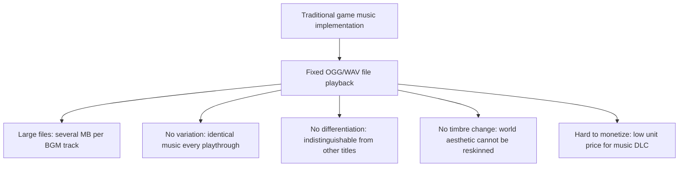

---

## 3. Solution and Concept

### 3.1 Core Concept

> **Separate "song structure" from "timbre" and sell each as an independent product.**  
> Quyno defines *what to play*. Sinto defines *how it sounds*.

### 3.2 Replacing FluidSynth

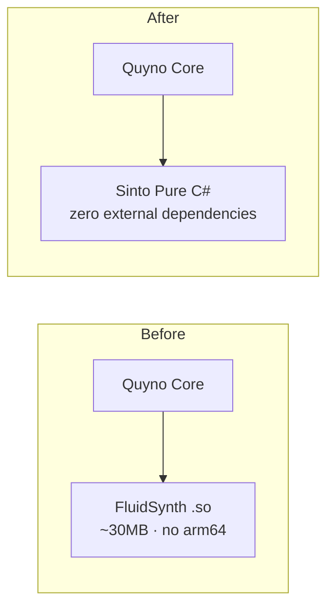

Migrating to Pure C# resolves arm64-v8a, iOS, WebGL, copy protection, and MIT licensing in a single move.

### 3.3 License: MIT Confirmed

The original MeowziQ used GNU GPL v2. The GPL's copyleft provision requires any game that incorporates it to publish its full source code — directly contradicting commercial game and DLC sales. **MIT** removes all restrictions on commercial use.

---

## 4. System Overview

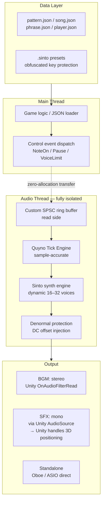

### 4.1 Thread Isolation: The Most Critical Design Principle

Full respect for the asynchrony between the audio thread and the main thread.

**Three absolute rules:**

1. Never use `lock` on the audio thread
2. All shared data access via **custom fixed-length ring buffer + `Interlocked`** only (`ConcurrentQueue<T>` is forbidden)
3. Quyno's tick calculation executes inside the audio thread's sampling loop (sample-accurate)

#### Why `ConcurrentQueue<T>` is Forbidden

`ConcurrentQueue<T>` is internally implemented as a linked list of segments. When a segment is exhausted, it calls `new` internally, allocating on the GC heap. Since GC allocations on the audio thread are strictly forbidden, the standard library cannot be trusted here.

#### Custom Fixed-Length Ring Buffer

```csharp
// SPSC lock-free ring buffer
// Transfers arbitrary events from main thread → audio thread
public enum ControlEventKind : byte {
    NoteOn, NoteOff, Pause, Resume, SetVoiceLimit, SwapPreset, SetBPM
}
public readonly struct ControlEvent {
    public readonly ControlEventKind Kind;
    public readonly ushort OffsetFrames; // sample-accurate position in buffer
    public readonly int    IntParam;
    public readonly float  FloatParam;
    public readonly int    TrackId;
    public readonly int    Priority;
}
```

### 4.2 Latency Requirements by Use Case

| Use case | Path | Expected latency |
|---|---|---|
| In-game BGM | Unity OnAudioFilterRead | 20–80ms |
| In-game SFX (3D positioning handled by Unity) | Unity AudioSource + Sinto mono output | 20–80ms |
| Standalone instrument (Android) | Oboe direct | 8–12ms |
| Standalone instrument (Windows) | ASIO direct | 2–5ms |

---

## 5. Quyno — Procedural Music Sequencer

### 5.1 Proprietary "3-Chord" Modal Theory

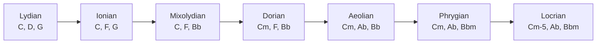

### 5.2 Song Data Structure

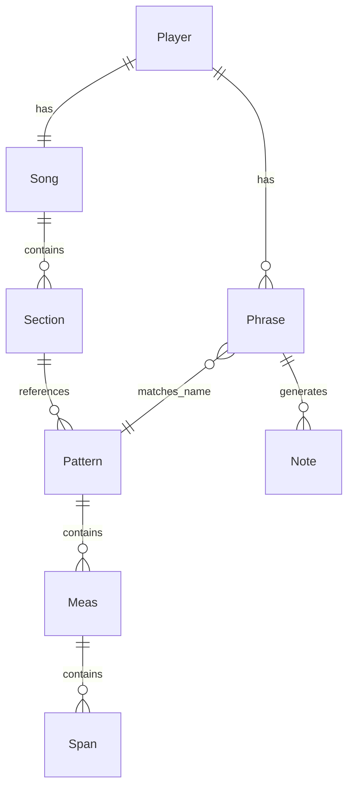

### 5.3 GC-Zero + Fast Math: 7 Principles

| Priority | Principle | Effect |
|---|---|---|
| Highest | `Note` → `readonly struct` | Eliminates the root cause of Gen0 GC |
| Highest | Remove Generator LINQ · reuse static buffers | 3 → 0 allocations per tick |
| Highest | Fast Sin/Tanh (decided by device benchmark) | Optimizes 705,600 calls/sec |
| High | Track LINQ → `for` / `RemoveAll` | Eliminates temporary List creation |
| High | `AllSpan` cache (dirty flag) | Zeroes List creation in build loop |
| Medium | Reuse `MemoryStream` | Eliminates double allocation on load |
| Auxiliary | `GCLatencyMode.SustainedLowLatency` | Blocks GC full collection during playback |

#### Fast Sin/Tanh: LUT vs Polynomial Approximation — Decided by Device Benchmark

| Method | Advantage | Disadvantage |
|---|---|---|
| LUT (`float[4096]`) | Single memory lookup · minimal error | Cache miss risk |
| Polynomial (parabolic · 5th-order Taylor) | Register-only · no cache | Lower precision (acceptable for audio) |

**Phase 1 task:** Implement both → benchmark with Unity Profiler + Android GPU Inspector → adopt the faster one.

---

## 6. Sinto — Software Synthesizer Engine

### 6.1 Synth Architecture

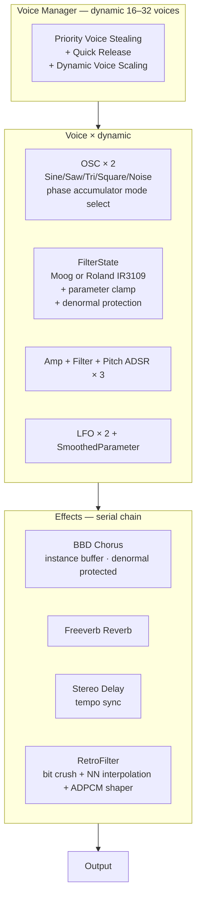

### 6.2 Voice Stealing: Quick Release Prevents Click Noise

Forcing a waveform to stop at a non-zero amplitude produces a "click" artifact. Any stolen voice must fade out over 5ms (Quick Release) before being freed.

```csharp
void StealVoice(int voiceIdx) {
    var v = _voices[voiceIdx];
    if (MathF.Abs(v.CurrentAmplitude) < 0.001f) {
        v.State = VoiceState.Free;
    } else {
        v.State = VoiceState.QuickRelease;
        v.QuickReleaseSamples = (int)(0.005f * SAMPLE_RATE); // 220 samples
    }
}
```

### 6.3 Filter: Numerical Stability + Denormal Protection

```csharp
// FilterState struct — Moog and Roland algorithms in one struct
// switch(FilterMode) is JIT-inlined — no virtual dispatch, no boxing
float Process(float input, long sampleIndex) => _mode switch {
    FilterMode.Moog   => ProcessMoog(input, sampleIndex),
    FilterMode.Roland => ProcessRoland(input, sampleIndex),
    _                 => input
};

// Moog ladder — resonance clamped [0, 3.99], DenormalGuard on all states
// MathF.Min(MathF.Max()) — NOT Math.Clamp (NaN branch blocks SIMD)
float ProcessMoog(float input, long sampleIndex) {
    resonance = MathF.Min(MathF.Max(resonance * 4f, 0f), 3.99f);
    // ... Huovilainen model with DenormalGuard.Protect(s, sampleIndex)
}
```

### 6.4 Parameter Smoothing: No Zipper Noise

All real-time parameters use one-pole lowpass smoothing (~8ms) to prevent zipper noise during MIDI CC sweeps and LFO modulation. On NoteOn, all smoothers must snap instantly to their target values — otherwise the previous voice's parameter state causes a "pyun" transient artifact.

```csharp
// On NoteOn — always snap first
smoother.SnapToTarget();   // current = target (instantaneous)

// During playback — smooth interpolation
smoother.Tick();           // current += (target - current) × coeff
```

### 6.5 RetroFilter: Authentic N64 / PS1 Texture

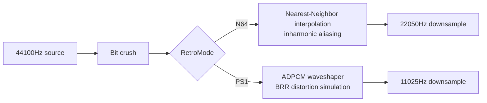

```csharp
// N64: no interpolation — truncated phase index
float ReadNN(float[] table, double phase)
    => table[(int)(phase * table.Length) % table.Length];

// PS1: ADPCM BRR distortion simulation
float AdpcmShape(float x)
    => MathF.Round(x * 16f) / 16f * 0.7f + x * 0.3f;
```

### 6.6 Preset Format (.sinto)

```json
{
  "name": "N64 Square Lead",
  "osc1": { "wave": "Square", "interpMode": "NearestNeighbor", "pw": 0.5 },
  "filter": { "type": "Moog", "cutoff": 0.8, "resonance": 0.2 },
  "ampEnv": { "attack": 0.01, "decay": 0.1, "sustain": 0.8, "release": 0.2 },
  "retro": { "mode": "N64", "sampleRate": 22050, "bitDepth": 16 }
}
```

---

## 7. Real-Device Survival Strategy

Three traps that only surface when running on physical mobile hardware. All must be addressed before writing the first line of code.

### 7.1 Denormal Bomb

**Problem:** When audio fades to silence, IIR filter feedback state approaches subnormal floats (e.g. `1e-30`). ARM CPUs process subnormal values via microcode emulation — **CPU load spikes 10–100×**. The game stutters the moment the music stops.

**Solution:** Inject an alternating DC offset (`1e-15f`, alternating sign via sample index parity) into every IIR feedback loop. Cost: one addition per sample per state variable.

```csharp
public static float Protect(float x, long sampleIndex)
    => x + ((sampleIndex & 1L) == 0L ? 1e-15f : -1e-15f);
```

### 7.2 Unity Pause (`Time.timeScale = 0`)

**Problem:** `OnAudioFilterRead` continues to be called by the OS audio hardware even when Unity is paused. The main thread's "game time" and the audio thread's "DSP time" diverge completely. When the game resumes, the sequencer attempts to catch up all accumulated ticks at high speed.

**Solution:** Send `Pause` / `Resume` control events through the ring buffer. The audio thread zeroes its output buffer and freezes tick advancement while paused.

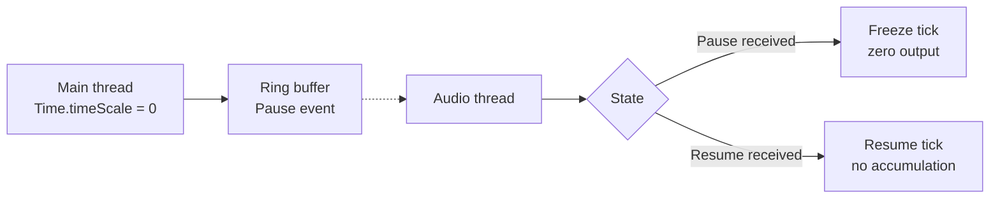

### 7.3 Thermal Throttling — Dynamic Voice Scaling

**Problem:** In hot weather, smartphones reduce CPU clock speed (thermal throttling). Fixed 32 voices work fine in a cool room but cause buffer underruns after 10 minutes of gameplay.

**Solution:** Dynamically scale the maximum voice count across three tiers (32 → 24 → 16) based on measured callback processing time. A cooldown of 64 callbacks (~300ms) prevents hunting after a tier change — Quick Release needs time to complete before load actually drops.

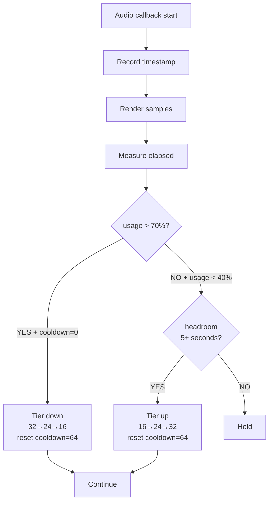

---

## 8. Explicit Out-of-Scope Definitions

### 8.1 3D Spatial Audio is Out of Scope for Sinto

**Decision:** Sinto does not implement 3D spatial positioning.

**Rationale:**

- Sinto is a synthesizer engine, not a spatial audio engine. Clean separation of concerns is required.
- Unity's `AudioSource` / `AudioListener` already handles distance attenuation, panning, and Doppler natively. Reimplementing this would be technical debt.
- Instantiating a full SintoEngine per enemy GameObject would instantly exhaust CPU.

**Sinto output specification:**

| Use | Output | 3D positioning |
|---|---|---|
| BGM | Stereo (Quyno-driven) | N/A |
| SFX | **Mono 1-voice** via `SintoMicroEngine` | **Unity AudioSource** |

### 8.2 Other Out-of-Scope Items

| Feature | Reason |
|---|---|
| PolyBLEP (anti-aliasing) | Aliasing is the aesthetic in N64/PS1 mode |
| Multi-output (per-track routing) | Unity AudioMixer handles this |
| VST / AU plugin (current) | Phase 5+. `RenderSamples(Span<float>)` guarantees future compatibility |
| Dynamic transposition | Documented as TODO constraint |

---

## 9. Business Model

### 9.1 Revenue Structure

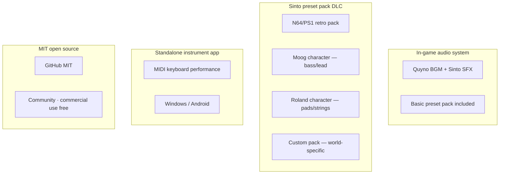

### 9.2 Copy Protection: Speed Bump Strategy

C# / IL2CPP has a fundamental limitation: AES keys hardcoded in the binary are extractable from `global-metadata.dat` in minutes with a hex editor. Memory dumps expose decrypted parameters at runtime.

**Goal:** Deter casual extraction, not defeat determined adversaries.  
**Strategy:** Price and convenience — make buying easier than reverse engineering.  
**Implementation budget:** 2 weeks maximum.

---

## 10. Technology Stack

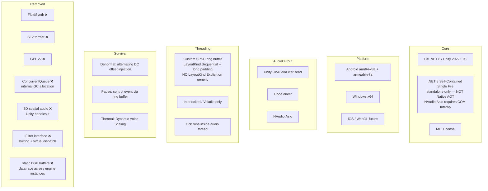

### 10.1 Design Principles Summary

**GC-Zero 7 Principles:**

1. `Note` → `readonly struct`
2. Remove Generator LINQ · reuse static buffers
3. Fast Sin/Tanh (LUT vs polynomial — decided by device benchmark)
4. Track LINQ → `for` / `RemoveAll`
5. `AllSpan` cache (dirty flag)
6. Reuse `MemoryStream` (`Position = 0`)
7. `GCLatencyMode.SustainedLowLatency`

**Thread Safety 3 Principles:**

1. No `lock` on audio thread
2. Custom SPSC ring buffer (no `ConcurrentQueue<T>`)
3. Tick calculation inside audio thread (sample-accurate)

**Voice Stealing 3 Principles:**

1. Prioritize release-phase voices for stealing
2. Drum tracks are Protected — never stolen by other tracks
3. Always apply Quick Release (5–10ms) on steal

**Real-Device Survival 3 Principles:**

1. **Denormal protection** — alternating DC offset injection in all IIR feedback loops
2. **Pause / Resume control events** — sent via ring buffer from main thread
3. **Dynamic Voice Scaling** — auto-switch between 32 ↔ 24 ↔ 16 voices under thermal load

---

## 11. Development Roadmap

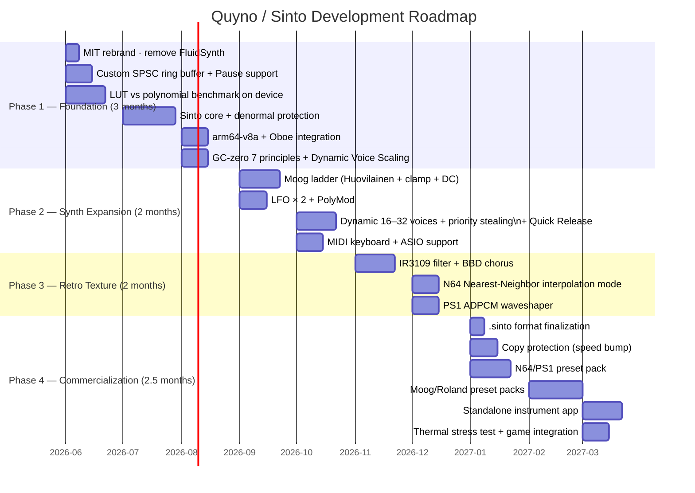

---

## 12. Risks and Mitigations

Gemini Rounds 1–4 fully applied. Final version.

| Risk | Severity | Mitigation |
|---|---|---|
| **Multi-thread race condition / crash** | **Critical** | **Custom SPSC ring buffer (Phase 1 first task)** |
| **Filter divergence (loud explosion)** | **Critical** | **Huovilainen + clamp + TanhFast** |
| **Denormal CPU spike** | **Critical** | **Alternating DC offset injection in all IIR loops** |
| **GPL v2 vs commercial conflict** | **Critical** | **Changed to MIT** |
| Voice Stealing click noise | High | Quick Release (5–10ms) — mandatory |
| Cache miss CPU spike | High | LUT vs polynomial decided by device profile |
| 16-voice shortage | High | Dynamic 16–32 voices + priority stealing + drum protection |
| Thermal throttling underrun | High | Dynamic Voice Scaling (32→24→16 auto-switch) |
| Unity pause vs DSP time divergence | High | Pause / Resume control events |
| Unity / Oboe latency confusion | High | Explicit per-use-case path documentation |
| AES-256 overconfidence | Medium | Speed bump framing — 2-week implementation cap |
| Oboe device-specific bugs | Medium | Auto buffer size adjustment + fallback |
| Preset production cost underestimate | Medium | Pilot production for data collection |
| "Quyno" read as "Kuino" (悔い = regret) in Japanese | Low | Brand guide specifies pronunciation "Kyoo-no" |

---

## Summary

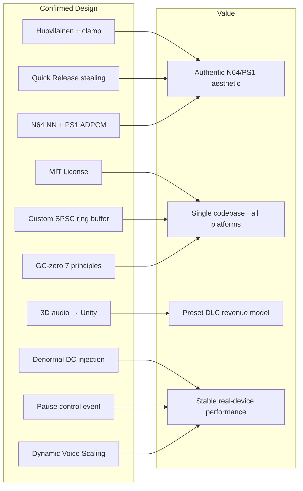

### Three Repositories

```
Koleco  ─────────────────────────────  Portfolio site
                                              │
Quyno  ──── defines song structure ───┐       │
                                      ├── Game ┤
Sinto  ──── defines timbre ────────────┘       │
              │                                │
              └──── Standalone instrument app ─┘
                         │
                         └── MIDI keyboard performance
```

### Phase 1 — First Three Tasks

```
1. Initialize Quyno / Sinto repositories with MIT license
2. Implement AudioRingBuffer<ControlEvent> (including Pause / Resume)
3. Implement both LUT and polynomial Sin/Tanh and benchmark on Android device
```

**Design phase complete. Write code.**

---

*© STUDIO MeowToon — MIT License*  
*project_proposal_v1.md — translated from quyno_sinto_proposal_v050.md*  
*Reviewed by Gemini (Rounds 1–4)*
