# Sinto — Synthesizer Specification v1.1

**Date:** 2026-05-25  
**Status:** Confirmed — GO  
**Based on:** Juno-106 architecture + extensions  
**Target:** Mobile 3D games (N64/PS1 aesthetic) + 80s SFX + MIDI keyboard performance  
**Audio Quality:** "Good enough for games" — designed to be refinable later  
**Future:** VST3 via VST.NET (Phase 5+) — guaranteed by `RenderSamples(Span<float>)` API

---

## Table of Contents

1. [Overview](#1-overview)
2. [Signal Flow](#2-signal-flow)
3. [Oscillators](#3-oscillators)
4. [Filter](#4-filter)
5. [Envelopes](#5-envelopes)
6. [LFO](#6-lfo)
7. [Portamento](#7-portamento)
8. [Effects Chain](#8-effects-chain)
9. [Parameter Smoothing](#9-parameter-smoothing)
   - [9.4 Smoothing Snap on NoteOn](#94-smoothing-snap-on-noteon)
10. [Polyphony and Voice Management](#10-polyphony-and-voice-management)
11. [MIDI Implementation](#11-midi-implementation)
12. [Output Modes](#12-output-modes)
13. [BPM Sync](#13-bpm-sync)
14. [Retro Mode](#14-retro-mode)
15. [Out of Scope](#15-out-of-scope)
16. [Design Rationale](#16-design-rationale)

---

## 1. Overview

Sinto is a Pure C# polyphonic software synthesizer engine inspired by the Roland Juno-106 (1984), extended with a second oscillator, dual filter modes, three independent envelopes, dual LFOs, and a complete effects chain.

### Design Philosophy

```
Base architecture : Roland Juno-106
Extension 1       : OSC × 2 (Juno had only 1 DCO)
Extension 2       : Moog Ladder filter mode (for bass/SFX punch)
Extension 3       : Pitch ADSR (essential for 80s SFX)
Extension 4       : LFO S&H (essential for retro computer sounds)
Extension 5       : Portamento (essential for robot voices / glide)

Sound accuracy    : "Juno-106 in spirit" — not circuit-level emulation
Refinability      : All DSP blocks are interface-abstracted for future upgrade
VST future        : RenderSamples(Span<float>) API enables VST3 wrapping
```

### Supported Use Cases

| Use Case | Description |
|---|---|
| Game BGM | Procedural music via Quyno sequencer |
| Game SFX | Beam guns, warps, explosions, robot voices |
| MIDI keyboard | Real-time performance (ASIO / Oboe standalone) |
| VST plugin | Phase 5 — DAW integration via VST.NET |

---

## 2. Signal Flow

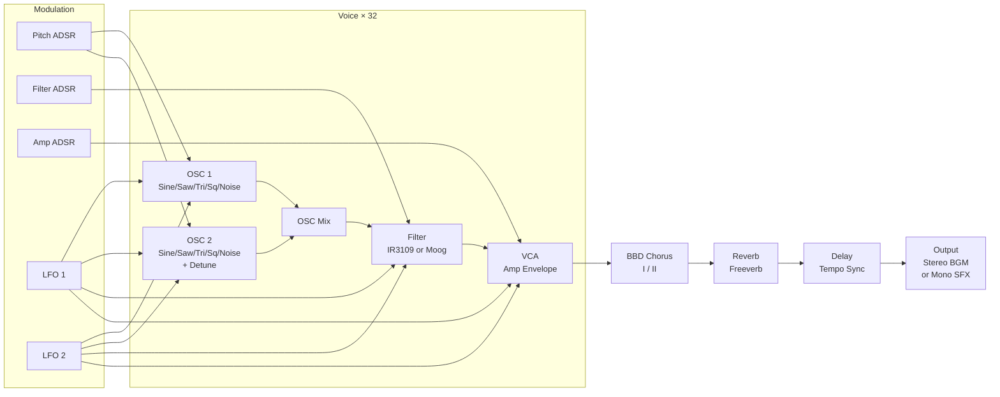

---

## 3. Oscillators

### 3.1 Configuration

| Parameter | OSC 1 | OSC 2 |
|---|---|---|
| Waveforms | Sine / Saw / Triangle / Square / Noise | Sine / Saw / Triangle / Square / Noise |
| Detune | — | -100 to +100 cents |
| Pulse Width | 0.01 to 0.99 (Square only) | 0.01 to 0.99 (Square only) |
| Interpolation | Linear or Nearest-Neighbor | Linear or Nearest-Neighbor |
| Level | 0.0 to 1.0 | 0.0 to 1.0 |

### 3.2 Waveform Characteristics

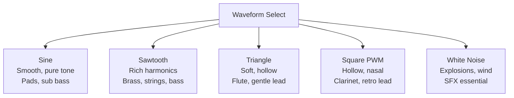

### 3.3 Interpolation Mode

| Mode | Algorithm | Character | Use Case |
|---|---|---|---|
| `Linear` | Linear interpolation on phase readout | Clean, standard | BGM, pads, bass |
| `NearestNeighbor` | Truncated phase index, no interpolation | Inharmonic aliasing | N64 aesthetic, lo-fi SFX |

### 3.4 Detune

OSC 2 only. Creates beating between OSC 1 and OSC 2 — the foundation of the Juno "fat" sound.

```
Detune = 0 cents   → Unison (phase-locked)
Detune = ±5 cents  → Subtle warmth (classic Juno pad)
Detune = ±50 cents → Wide, detuned lead
Detune = ±100 cents → One semitone apart (interval)
```

---

## 4. Filter

### 4.1 Filter Modes

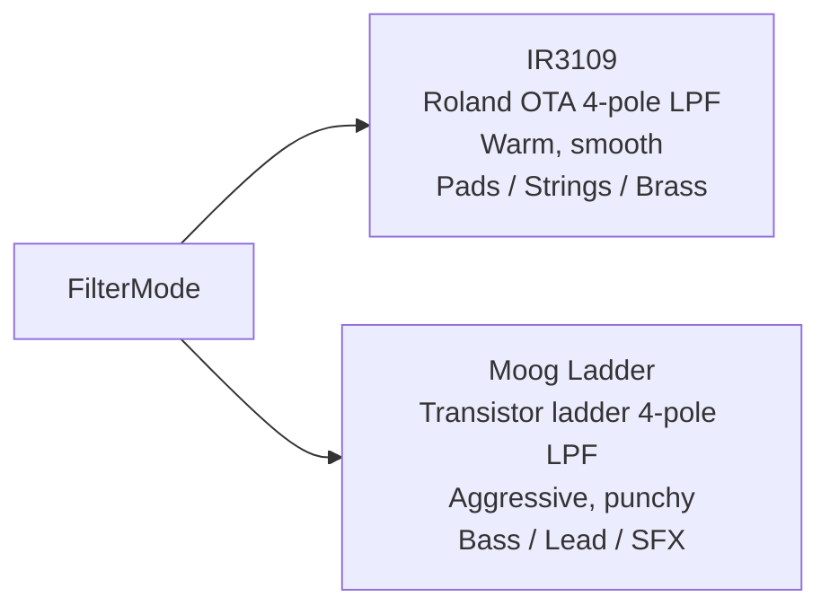

Both modes share the same parameter set. Internal algorithm differs.

### 4.2 Parameters

| Parameter | Range | Description |
|---|---|---|
| `Cutoff` | 0.0 – 1.0 | Filter cutoff frequency |
| `Resonance` | 0.0 – 1.0 | Resonance / self-oscillation (internal clamp: 3.99) |
| `EnvAmt` | -1.0 – +1.0 | Filter Envelope amount. Negative = inverted filter sweep |
| `KeyFollow` | 0.0 – 1.0 | Cutoff tracks note pitch (1.0 = full tracking) |
| `FilterMode` | Roland / Moog | Algorithm selection |

### 4.3 Self-Oscillation

At maximum Resonance, both filter modes enter self-oscillation (produce a sine-like tone without input signal). This is the foundation of classic SFX sounds.

```
Resonance → 1.0
  Roland mode : Clean sine-like whistle
  Moog mode   : Aggressive, distorted sine

Use cases: Beam gun tones, laser sweeps, sci-fi drones
```

### 4.4 Numerical Stability

Resonance is internally clamped to 3.99 (Moog model) to prevent divergence and speaker-damaging output. `MathF.Min(MathF.Max(...))` — never `Math.Clamp` in hot path.

---

## 5. Envelopes

Three independent ADSR envelopes. Each controls a separate destination.

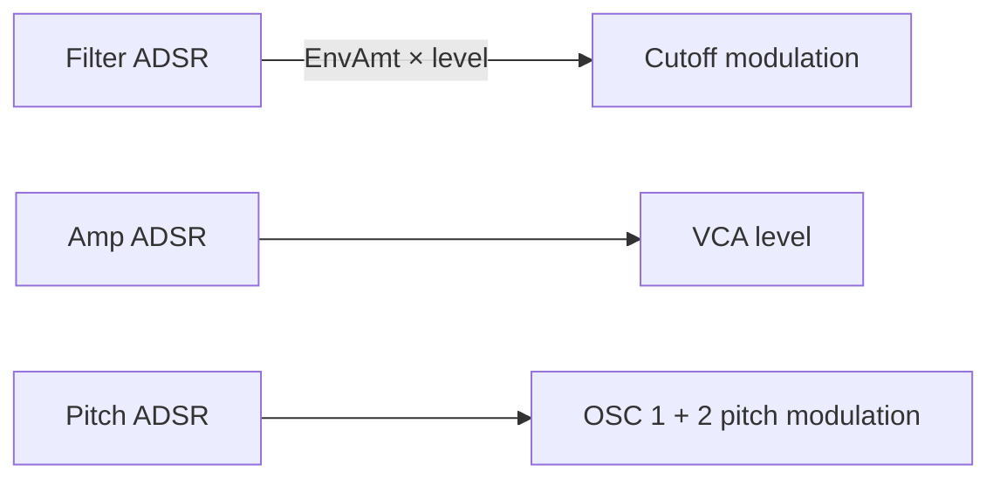

### 5.1 Parameters (per envelope)

| Parameter | Range | Min value | Reason for minimum |
|---|---|---|---|
| Attack | 0.001 – 10.0 sec | 0.001 | Prevents division by zero in rate computation |
| Decay | 0.001 – 10.0 sec | 0.001 | Same |
| Sustain | 0.0 – 1.0 | 0.0 | Zero sustain = percussion mode |
| Release | 0.001 – 20.0 sec | 0.001 | Same |

### 5.2 Pitch ADSR — 80s SFX Applications

The Pitch ADSR is the key to authentic 80s game SFX. It modulates both OSC 1 and OSC 2 pitch simultaneously.

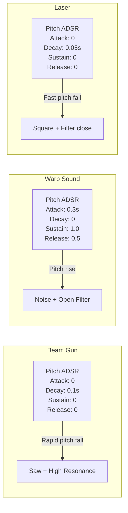

### 5.3 Envelope State Machine

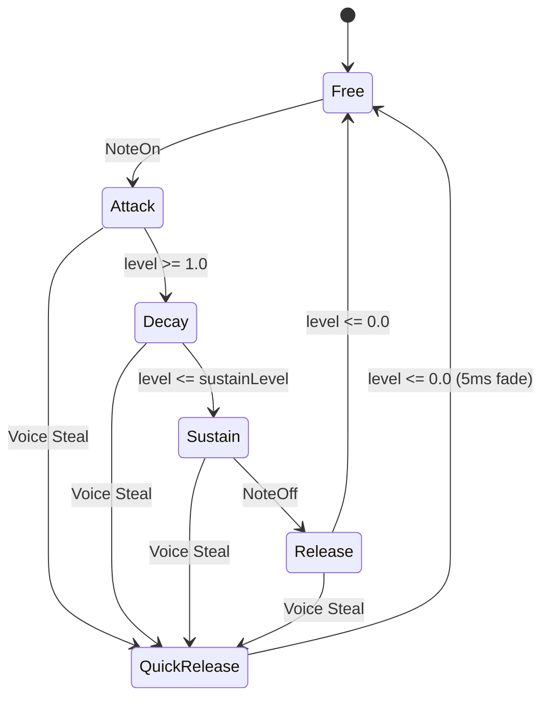

---

## 6. LFO

Two independent LFOs. Each can target any combination of destinations simultaneously.

### 6.1 Parameters (per LFO)

| Parameter | Range | Description |
|---|---|---|
| `Wave` | Sine / Triangle / Square / S&H | LFO waveform |
| `Rate` | 0.01 – 20.0 Hz (free) or 1/32 – 4 bars (sync) | LFO speed |
| `Depth` | 0.0 – 1.0 | Modulation amount |
| `TempoSync` | On / Off | Lock rate to BPM grid |
| `Destinations` | Bitmask (see below) | What to modulate |

### 6.2 Modulation Destinations

| Destination | Effect |
|---|---|
| `OSC1_Pitch` | Vibrato on OSC 1 |
| `OSC2_Pitch` | Vibrato on OSC 2 |
| `OSC1_PWM` | Pulse width modulation on OSC 1 Square |
| `OSC2_PWM` | Pulse width modulation on OSC 2 Square |
| `FilterCutoff` | Wah / filter sweep |
| `Amp` | Tremolo |

### 6.3 S&H (Sample and Hold) — Retro Computer Sounds

```
LFO Wave = S&H:
  Every N samples, freeze current value and jump to new random value.
  Creates staircase modulation — the "beeping computer" sound.

Use cases:
  Random pitch jumps    : Computer terminals, R2D2-style
  Random filter steps   : Arpeggio-like filter sweep
  Random amp steps      : Stuttering gate effect
```

### 6.4 Tempo Sync Grid

| Value | Duration at 120 BPM |
|---|---|
| 1/32 | 62.5 ms |
| 1/16 | 125 ms |
| 1/8 | 250 ms |
| 1/4 | 500 ms |
| 1/2 | 1000 ms |
| 1 bar | 2000 ms |
| 2 bars | 4000 ms |
| 4 bars | 8000 ms |

---

## 7. Portamento

Smooth pitch glide between notes.

| Parameter | Range | Description |
|---|---|---|
| `Time` | 0.0 – 5.0 sec | Glide time (0 = instant) |
| `Mode` | Legato / Always | Legato = only when keys overlap |

```
Use cases:
  Robot voice    : Short portamento + Square wave
  Space sweep    : Long portamento + Pitch ADSR
  Bass slide     : Medium portamento + Saw + Moog filter
```

---

## 8. Effects Chain

Effects are connected in series — stompbox style.

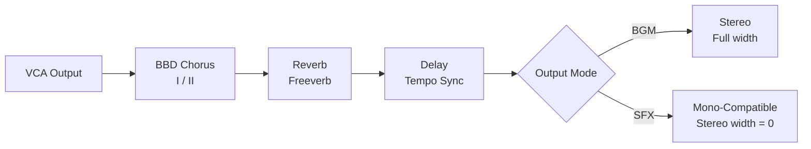

### 8.1 BBD Chorus

Emulates the Roland MN3009 Bucket Brigade Device chorus — the signature sound of the Juno-106.

| Parameter | Range | Description |
|---|---|---|
| `Mode` | I / II | Mode I: slow/deep (strings). Mode II: fast/shallow (pads) |
| `Rate` | 0.1 – 10.0 Hz | LFO rate for delay time modulation |
| `Depth` | 0.0 – 1.0 | Modulation depth |
| `Mix` | 0.0 – 1.0 | Dry/wet balance |
| `MonoCompatible` | On / Off | Force stereo width to 0 (SFX mode) |

```
Mode I  : Rate ~0.5 Hz, deep modulation → lush strings, slow pads
Mode II : Rate ~3.0 Hz, shallow modulation → shimmering pads, bright leads
```

### 8.2 Reverb (Freeverb)

| Parameter | Range | Description |
|---|---|---|
| `RoomSize` | 0.0 – 1.0 | Room size (larger = longer decay) |
| `Damping` | 0.0 – 1.0 | High-frequency damping |
| `Mix` | 0.0 – 1.0 | Dry/wet balance |
| `MonoCompatible` | On / Off | Force mono output (SFX mode) |

### 8.3 Delay

| Parameter | Range | Description |
|---|---|---|
| `Time` | 1 – 2000 ms (free) or grid (sync) | Delay time |
| `Feedback` | 0.0 – 0.95 | Feedback amount (max 0.95 to prevent runaway) |
| `Mix` | 0.0 – 1.0 | Dry/wet balance |
| `TempoSync` | On / Off | Lock to BPM grid |

### 8.4 Mono-Compatible Mode

Critical for 3D SFX in Unity. When Unity's AudioSource converts stereo to mono for 3D positioning, out-of-phase chorus components cancel and produce silence.

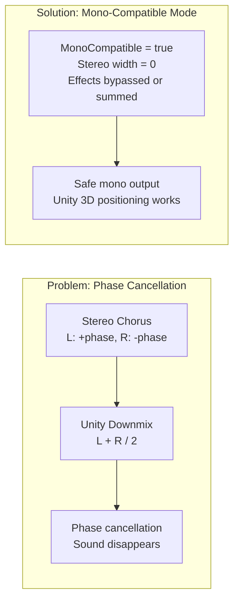

**Rule: SFX emitters always use `MonoCompatible = true`. BGM uses stereo.**

---

## 9. Parameter Smoothing

All real-time controllable parameters use one-pole lowpass smoothing to prevent zipper noise.

### 9.1 What is Zipper Noise?

When a parameter (e.g. Cutoff) is changed at control rate (~200 Hz) while audio runs at 44,100 Hz, the waveform steps discontinuously. This creates audible "zipper" artifacts — especially damaging during MIDI CC sweeps.

### 9.2 Smoothing Implementation

```
Target value updated by: MIDI CC, LFO, Envelope, user preset change
Current value updated per sample:
  current += (target - current) × smoothingCoeff

smoothingCoeff = 1 - exp(-2π × cutoffHz / sampleRate)
  cutoffHz = 20 Hz → smoothing time ≈ 8ms (imperceptible, no zipper)
```

### 9.3 Parameters Requiring Smoothing

| Parameter | Reason |
|---|---|
| Filter Cutoff | MIDI CC sweeps, LFO modulation |
| Filter Resonance | MIDI CC |
| OSC Level (1 and 2) | Volume changes |
| Amp Level | Master volume, expression pedal |
| LFO Depth | MIDI CC |
| Portamento target pitch | Pitch transitions |
| Delay Feedback | Prevent feedback runaway clicks |

---

## 10. Polyphony and Voice Management

### 10.1 Voice Count

| Tier | Max Voices | Condition |
|---|---|---|
| Normal | 32 | Default |
| Reduced | 24 | CPU usage > 70% of buffer duration |
| Minimal | 16 | CPU usage > 70% after tier-down cooldown |

Dynamic Voice Scaling adjusts tiers automatically. Cooldown of 64 callbacks (~300ms) prevents hunting.

### 10.2 Voice Stealing Priority

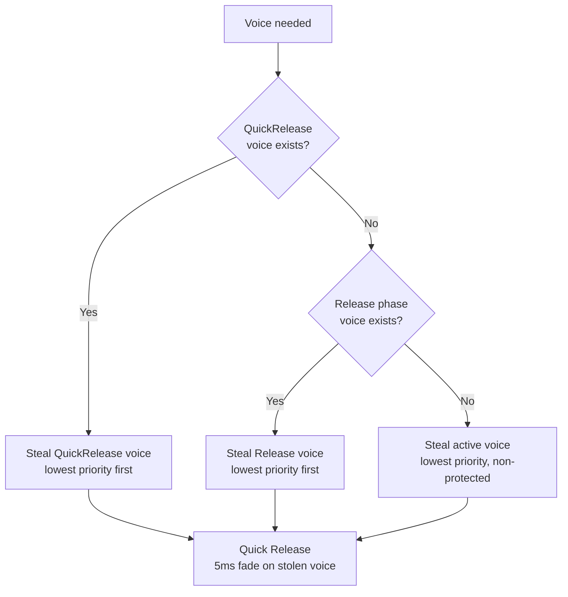

### 10.3 Track Voice Reservation

| Track | Role | Reserved | Priority | Protected |
|---|---|---|---|---|
| 0 | Drum | 2 | 10 | YES |
| 1 | Percussion | 2 | 10 | YES |
| 2 | Bass | 2 | 8 | No |
| 3 | Pad | 4 | 5 | No |
| 4 | Obligato 1 | 2 | 7 | No |
| 5 | Obligato 2 | 2 | 7 | No |
| 6 | Melody 1 | 4 | 6 | No |
| 7 | Melody 2 | 4 | 6 | No |

---

## 11. MIDI Implementation

### 11.1 Supported Messages

| Message | CC / Status | Action |
|---|---|---|
| Note On | 0x9n | Trigger voice |
| Note Off | 0x8n | Release voice |
| Pitch Bend | 0xEn | ±2 semitone pitch shift (default range) |
| Modulation | CC 1 | LFO 1 Depth |
| Volume | CC 7 | Master output level |
| Sustain Pedal | CC 64 | Hold notes after NoteOff |
| All Notes Off | CC 123 | Emergency voice kill |

### 11.2 ControlEvent Extensions

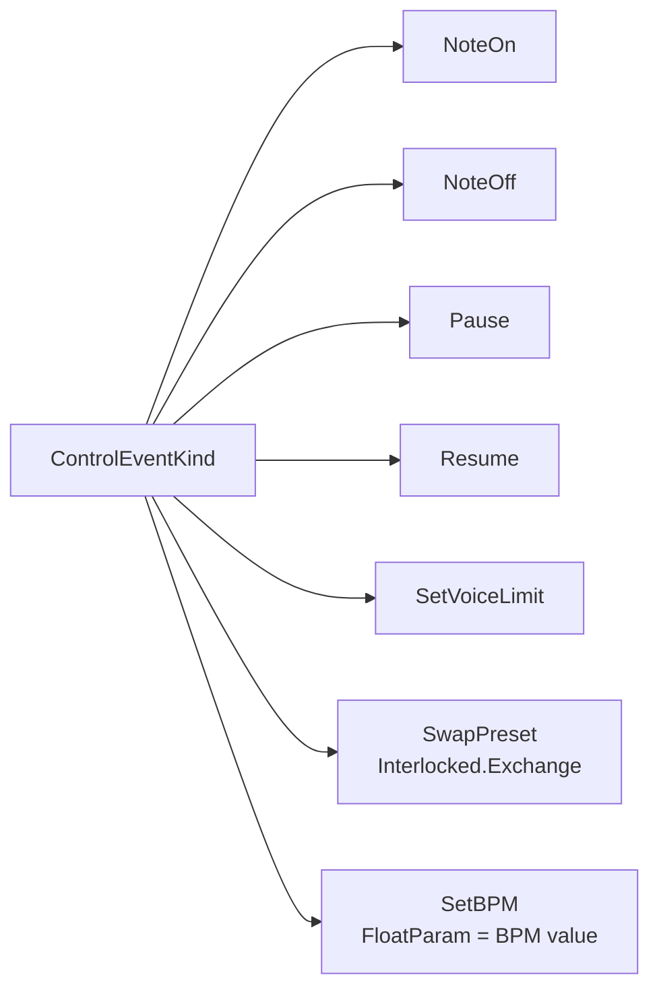

`SetBPM` is sent by:
- Quyno sequencer (on song load and tempo change)
- Standalone app (user BPM knob)
- VST host (DAW tempo via `processBlock` — Phase 5)

---

## 12. Output Modes

### 12.1 BGM Mode (Stereo)

Full stereo output. All effects at full stereo width. Used with Unity `OnAudioFilterRead` for background music.

```
Output channels : 2 (stereo)
Chorus width    : Full
Reverb width    : Full
Use case        : BGM via Quyno sequencer
```

### 12.2 SFX Mode (Mono-Compatible)

Mono output for Unity 3D AudioSource. Prevents phase cancellation when Unity downmixes for 3D positioning.

```
Output channels     : 1 (mono) or stereo with width = 0
Chorus              : MonoCompatible = true (width zeroed)
Reverb              : MonoCompatible = true (L+R summed)
Use case            : Per-GameObject SFX emitter
Unity integration   : SintoSfxEmitter MonoBehaviour
```

### 12.3 Standalone Mode

Direct Oboe (Android) or ASIO (Windows) output. No Unity dependency. Used for MIDI keyboard performance.

```
Android : Oboe → 8-12ms latency
Windows : ASIO → 2-5ms latency
Thread  : ThreadPriority.Highest (set on audio thread start)
```

---

## 13. BPM Sync

LFO tempo sync and Delay tempo sync both depend on a BPM value supplied externally.

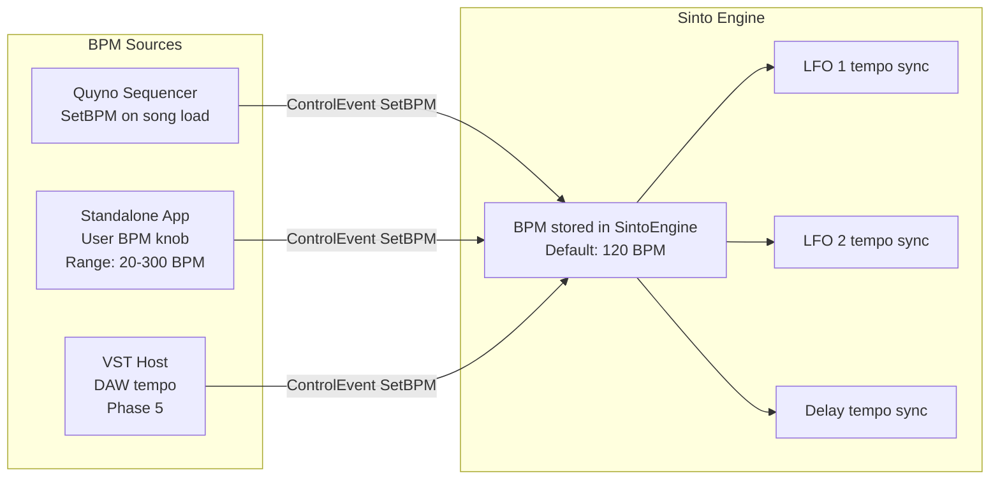

**Default BPM: 120. Used when no SetBPM event has been received.**

---

## 14. Retro Mode

N64/PS1 aesthetic processing. Applied after the effects chain, before final output.

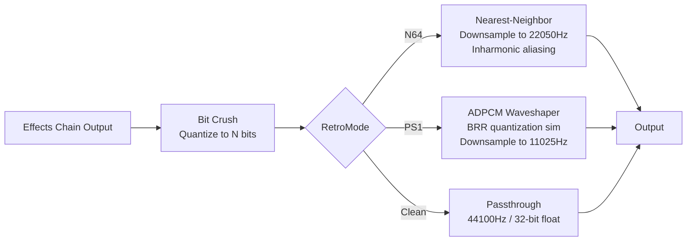

| Mode | Sample Rate | Bit Depth | Character |
|---|---|---|---|
| `N64` | 22050 Hz | 16 bit | Metallic aliasing, inharmonic crunch |
| `PS1` | 11025 Hz | 8 bit | Gritty, compressed, BRR warmth |
| `Clean` | 44100 Hz | 32 bit float | Modern, no degradation |

**PolyBLEP (anti-aliasing) is intentionally NOT implemented. Aliasing is the aesthetic.**

---

## 15. Out of Scope

The following features are explicitly excluded. Decisions are final for v1.

| Feature | Reason |
|---|---|
| High-pass filter | Removed to halve IR3109 implementation cost. Unity EQ can compensate if needed. |
| Real drum samples | Sinto is a synthesizer. Sample playback is Unity AudioSource's responsibility. |
| PolyMod (Prophet-5 style) | Complexity vs. benefit ratio too low for game audio use case. |
| OSC hard sync | Same as above. |
| Full circuit-level emulation | Goal is "Juno spirit", not oscilloscope accuracy. DSP blocks are refinable. |
| VST3 plugin (current) | Phase 5+. `RenderSamples(Span<float>)` API guarantees future compatibility. |
| 3D spatial audio in Sinto | Unity AudioSource / AudioListener handles all 3D positioning. |

---

## 16. Design Rationale

### 16.1 Why Juno-106 as base?

```
Juno-106 architecture advantages:
  Single DCO (now 2 in Sinto) — simplest polyphonic synth structure
  IR3109 filter — Roland's warmest, most musical filter
  BBD chorus — defines the Juno sound, essential for pads/strings
  6-voice poly (now 32 in Sinto) — straightforward voice architecture

What was added:
  OSC 2 + Detune : solves Juno's "thin without chorus" weakness
  Moog filter    : adds bass/SFX punch Juno lacks
  Pitch ADSR     : unlocks all 80s SFX vocabulary
  LFO S&H        : retro computer sounds, essential for game SFX
  Portamento     : robot voices, space sweeps
```

### 16.2 Why two filter modes?

```
IR3109 (Roland) : Warm, smooth, organic — pads, strings, brass
Moog Ladder     : Punchy, aggressive — bass, SFX, beam guns

Same parameter set, different DSP algorithm.
Switchable per preset. No CPU overhead when not modulating.

A game soundtrack needs both:
  Soft background pads → Roland
  Hard SFX hits       → Moog
```

### 16.3 Why Pitch ADSR?

```
Without Pitch ADSR:
  Beam gun = Saw + filter sweep (generic)

With Pitch ADSR:
  Beam gun = Saw + pitch falls rapidly + resonance peak = authentic

80s SFX vocabulary requires pitch to move independently of amplitude.
This is the single most important feature for game SFX.
```

### 16.4 Why MonoCompatible mode for effects?

```
Unity 3D AudioSource downmixes stereo to mono for spatial positioning.
BBD chorus produces out-of-phase L/R signal.
Out-of-phase + mono downmix = phase cancellation = silence.

MonoCompatible = true zeros the stereo width before downmix.
No cancellation. 3D positioning works correctly.

BGM = stereo (full chorus width)
SFX = mono-compatible (width = 0)
```

### 16.5 Why parameter smoothing?

```
MIDI CC operates at ~200 Hz (one value per ~5ms).
Audio runs at 44,100 Hz.

Without smoothing: parameter changes are staircases at audio rate.
Staircase = discontinuity = zipper noise = unusable as instrument.

One-pole lowpass at 20 Hz cutoff:
  Smoothing time ≈ 8ms — imperceptible to ear
  Eliminates all zipper artifacts
  Cost: one multiply-add per parameter per sample
```

---

*© STUDIO MeowToon — MIT License*  
*synthesizer_spec_v1.1.md — v1.1: Smoothing Snap on NoteOn added*
